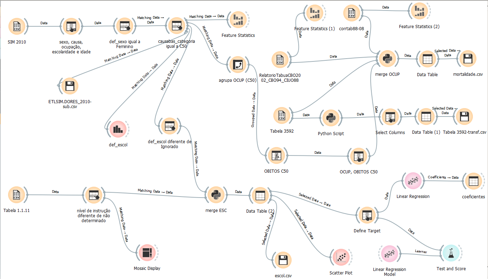

# Projeto Condições socioeconômicas e câncer de mama: estudo de correlação. 
# Project Socioeconomic conditions and breast cancer: correlation study

# Apresentação

O presente projeto foi originado no contexto das atividades da disciplina de pós-graduação [*Ciência e Visualização de Dados em Saúde*](https://github.com/datasci4health/home), oferecida no primeiro semestre de 2021, na Unicamp.

| Nome                           | RA        | Especialização |
|--------------------------------|-----------|----------------|
| Aline Borges                   | 210598    | Saúde          |
| Fátima Aparecida Tagliaferro   | 98918     | Computação     |
| Fernando Akune                 | 970709    | Computação     |
| Lana Soares                    | 209580    | Saúde          |

# Descrição Resumida do Projeto

O câncer é a principal causa de morte em países desenvolvidos e, segundo estimativas até o ano de 2030, será de 22,2 milhões de casos de câncer e 12,7 milhões de mortes no mundo, sendo que dois terços dos casos ocorrerão nos países pobres e em desenvolvimento como a principal causa de morbidade e mortalidade. O tipo de cancer que mais acomete brasileiras, representando em torno de 20,9% de todos os cânceres que afetam o sexo feminino ou 29,7%, excetuando-se o câncer de pele não melanoma, é o câncer de mama, uma doença causada pela multiplicação desordenada de células com alterações genicas que formam um tumor. De acordo com relatório elaborado pelo INCA, algumas profisões apresentam uma incidência maior deste tipo de câncer. As desigualdades em saúde refletem as desigualdades sociais. Embora mais aparentes nos estratos socioeconômicos desfavorecidos, as desigualdades em saúde operam através de toda a sociedade. Em relação ao câncer, as diferenças socioeconômicas se manifestam em diversos aspectos do seu perfil epidemiológico. Estudos nessa área representam uma abordagem essencial em epidemiologia e saúde pública, podendo contribuir para a identificação de fatores responsáveis por variações regionais dos níveis de saúde e para formulação de hipóteses a serem investigadas em futuras pesquisas. Dentro deste contexto, o presente trabalho teve como objetivo investigar associações entre idade, nível socioeconômico (anos de estudo), profissões (ocupação) e mortalidade por câncer de mama, através da análises de dados disponibilizados em bancos de acesso público.

# Vídeos do Projeto

## Vídeo da Proposta

https://youtu.be/DoauGouCxCo

## Vídeo da Apresentação Final
> Link para vídeo da apresentação final do projeto (máximo 8 minutos). *TODOS OS MEMBROS DO GRUPO DEVEM APARECER NO VÍDEO*.

# Slides do Projeto

## Slides da Proposta
> Link para slides de apresentação da proposta do projeto.

## Slides da Apresentação Final
> Link para slides da apresentação final do projeto.

# Introdução e Referenciais de Teóricos
> Contextualização do projeto
>
> Caracterização do problema
>
> Motivação
>
> Relevância
>
> Trabalhos relacionados

A maioria dos artigos sobre o tema utilizam Revisões sistemáticas de literatura para condensar e apresentar os dados:

* (https://referenciaincor.com.br/wp-content/uploads/2020/02/priscila-berenice-da-costa.pdf; https://www.scielosp.org/pdf/rsap/2014.v16n5/786-798; https://www.unicesumar.edu.br/mostra-2016/wp-content/uploads/sites/154/2017/01/juliana_santos_tortajada.pdf;  https://www.scielo.br/scielo.php?script=sci_arttext&pid=S1413-81232011000200025) 

* “Foram analisados os óbitos por câncer ocorridos entre 2010 e 2012, obtidos no Sistema de Informação sobre Mortalidade. Foram selecionados 268 municípios brasileiros que apresentaram população acima de 80 mil habitantes e melhor qualidade de informação. Os indicadores socioeconômicos referentes ao ano 2000 foram extraídos do Atlas Brasil 2013. Para analisar a correlação entre indicadores socioeconômicos e a mortalidade por câncer foi utilizada a Correlação de Pearson e a regressão linear simples. Resultados: Verificou-se correlação negativa com o analfabetismo (r=-0,509) e com o Gini (r=-0,197); a correlação foi positiva com o indicador de renda (r=0,414) e esperança de vida (r=0,537); a regressão linear simples mostrou que há uma associação fraca entre a mortalidade por câncer e as variáveis socioeconômicas pesquisadas.” (https://periodicos.unifor.br/RBPS/article/view/4291) 

* “O objetivo desse estudo foi analisar a influência dos índices socioeconômicos municipais nas taxas de mortalidade por câncer de boca e de orofaringe em idosos nas 645 cidades do Estado de São Paulo, Brasil. Dados secundários de óbitos foram obtidos no Sistema de Informações sobre Mortalidade do Ministério da Saúde. O número de idosos e os valores da renda média per capita e do Índice de Desenvolvimento Humano por município (IDH-M) foram obtidos de dados governamentais. A análise descritiva e exploratória dos dados foi realizada, seguida de modelos binomiais negativos descritos pelo procedimento PROC GENMOD e avaliados pelo AICc (Critério de Informação de Akaike corrigido), pelo grau de liberdade e pelo teste de Wald (α=0.05). 30% das cidades notificaram óbitos em 2013” (http://repositorio.unicamp.br/bitstream/REPOSIP/322214/1/Sakamoto_AssahitoJoel_M.pdf).

* “Objetivo: Investigar associações entre nível socioeconômico e incidência e mortalidade por câncer e seus tipos, através de revisão de estudos ecológicos. Definir a real importância desempenhada pelos estudos ecológicos na investigação dessa relação. Método: As principais bases de dados regionais e internacionais foram pesquisadas na seleção de artigos em português, espanhol e inglês, publicados entre 1998 e 2008. Resultados: 32 estudos elegíveis foram incluídos. Verificou-se associação positiva e consistente do nível socioeconômico da área de residência com incidência de câncer de próstata e mortalidade pelo de cólon nos homens, e com incidência e mortalidade por câncer de mama e mortalidade pelo de cólon nas mulheres. Associação consistente e negativa foi encontrada para incidência e mortalidade por cânceres de esôfago e estômago, para incidência dos de cólon e pulmão e mortalidade pelos de laringe e cavidade oral, nos homens, e para incidência e a mortalidade pelos de esôfago, estômago e colo uterino e para incidência dos de cólon e pulmão, nas mulheres. Conclusão: Apesar da presença de efeito residual de área e de viés relacionado à medida agregada de nível socioeconômico, estudos ecológicos podem ser eficientemente utilizados na mensuração das desigualdades socioeconômicas em câncer. Uso de pequenas unidades geográficas e de dados de registros de câncer em países em desenvolvimento pode contribuir para melhor conhecimento de suas desigualdades em saúde” (https://www.revistas.usp.br/sausoc/article/download/76484/80219)

* “Chronic non-communicable diseases represent a major public health problem, requiring more effective investigation and control by government agencies. The aim of this study was to correlate the mortality rate for oral cancer in Brazilian State capitals from 1998 to 2002 with socioeconomic factors collected in the 2000 census, using an ecological study design. Data were obtained from the Mortality Information System from 1998 to 2002. Social factors were taken from the Brazilian Human Development Atlases. After data collection, statistical analysis was performed using Pearson's correlation index. The findings included positive and significant correlations among the socioeconomic indicators (Municipal Human Development Index - MHDI, MHDI-income, MHDI-education, MHDI-life expectancy, and per capita income), and negative and significant correlations with the socioeconomic indicators Gini Index and infant mortality. Despite the study’s limitations and probable underreporting in less developed State capitals, the study found significant statistic correlations between the selected socioeconomic indicators and the oral cancer mortality rate.” (https://repositorio.ufrn.br/bitstream/1/3055/1/2010ART_Mortalidade_Angelloroncalli.pdf)
> Indicação (bastante resumida) da análise proposta

Visando preencher a lacuna de conhecimento em desigualdades sociais na mortalidade do câncer de mama, procedeu-se a tentativa de analisar dados disponibilizados através de bancos de acesso público, entre os anos X e Y, que tratam da relação entre o status socioeconômico e a mortalidade por câncer de mama. 
A ideia inicial da análise proposta era verificar se a renda ou a educação apresentavam alguma influência no desfecho do câncer de mama. Uma vez que a obtenção dos dados de pessoas curadas se demonstrou inviável, decidimos utilizar os dados referentes à mortalidade da doença.
As primeiras análises de IDH x taxa de mortalidade não indicaram correlação, então foram realizadas análises a partir de cada registro de óbito do ano de 2010. Considerando o artigo do INCA que cita as profissões com maior incidência de câncer, acrescentamos como objetivo a verificação da semelhança dos dados trazidos no artigo com os dados de mortalidade. A fim de tentar buscar alguma correlação com aspectos socieconomicos, realizamos um modelo de regressão usando as variáveis idade e escolaridade (agrupadas), uma vez que para cálculo da taxa por 100 mil, precisamos do número de óbitos da população em cada grupo.

> Indicação (bastante resumida) dos resultados alcançados

# Perguntas de Pesquisa
* A condição socioeconômica do paciente impacta no desfecho do tratamento de câncer de mama?
* Existe uma correlação entre a mortalidade por câncer de mama com determinadas profissões?

# Objetivos do Projeto
> Como seu projeto propôs abordar o problema apresentado.

O objetivo deste projeto foi investigar associações entre idade, nível socioeconômico (anos de estudo), profissões (ocupação) e mortalidade por câncer de mama, através da análises de dados disponibilizados em bancos de acesso público.

# Metodologia
> Abordagem adotada pelo projeto na busca pela resposta às perguntas de pesquisa.
> Justificar teoricamente, sempre que possível, a metodologia adotada. 

A metodologia utilizada para desenvolvimento desta pesquisa foi  (1) estratégias de seleção de dados guiadas por perguntas de pesquisa; (2) técnicas de pré-processamento; (3) etapas típicas de transformação, incluindo anonimização de dados; (4) análise e mineração de dados; (5) interpretação e avaliação por meio de técnicas de visualização de dados. (precisa descrever como utilizamos, copiei esse trecho da disciplina)

## Bases de Dados e Evolução

Listamos aqui bases de dados iniciais, candidatas à nossa pesquisa. 

### Brasil

https://datasus.saude.gov.br/

http://dados.gov.br/dataset/ (Portal brasileiro de dados abertos)

https://mortalidade.inca.gov.br/MortalidadeWeb/pages/Modelo01/consultar.xhtml 

http://dados.gov.br/dataset/anvisa-preco-de-medicamento-consumidor (Preço remédio dataset)

http://dados.gov.br/dataset/ubs_existentes (Distribuição Unidades Básicas de Saúde Existentes-UBS)

https://www.inca.gov.br/estimativa/introducao 

http://saudepublica.bvs.br/

http://www.perfil.seade.gov.br/ (São Paulo data set)

http://aplicacao.saude.gov.br/portaltransparencia/visao/dadosTransparencia.jsf?uf=%27GO%27 (Saúde e econômia Dataset)

https://cidades.ibge.gov.br/brasil/pesquisa/30/84366 (Pesquisa nacional de saneamento básico)

http://sigtap.datasus.gov.br/tabela-unificada/app/sec/inicio.jsp (sistema de gerenciamento da tabela de procedimentos, medicamentos e OPM do SUS)

http://www.ans.gov.br/anstabnet/ (ANS TABNET)

http://www.atlasbrasil.org.br/

https://www.inca.gov.br/sites/ufu.sti.inca.local/files//media/document//cancer-in-brazil-vol4-2013.pdf (pdf mas com tabelas por estado)

https://bigdata.icict.fiocruz.br/ (Plataforma de Ciência de Dados aplicada à saúde)

https://bvsalud.org/ (Biblioteca virtual de saúde)

https://mtci.bvsalud.org/pt/

### Internacional

https://data.world/dartmouthatlas/cancer-patients-death (mortalidade por estado nos EUA) 

https://data.mendeley.com/datasets (Mendeley Data Repository)

https://virtualpatients.eu/ (Eletronic virtual pacients)

https://virtualpatients.eu/referatory/ (Referatory)

https://www.nlm.nih.gov/mesh/meshhome.html (Medical Subject Headings (MeSH))

https://www.cancerimagingarchive.net/collections/ (Cancer Imaging Archive)

https://datascience.cancer.gov/resources/nci-data-catalog#drugdiscovery (National cancer Institute Data Catalog)

https://www.scielo.br/scielo.php?script=sci_arttext&pid=S0482-50042017000600574 (Scielo)

http://www.diseasesdatabase.com/begin.asp (Diseases Database)

https://seer.cancer.gov/canques/ (National Cancer Institute - Cancer Query Systems)

https://seer.cancer.gov/ (All Cancer Sites Combined Database)

http://portals.broadinstitute.org/cgi-bin/cancer/datasets.cgi (Cancer Program Datasets)

https://toxnet.nlm.nih.gov/cgi-bin/sis/htmlgen?CCRIS (CCRIS)

https://www.cdc.gov/cancer/dcpc/data/ (Cancer Data and Statistics)

https://portal.gdc.cancer.gov/ (GDC Data Portal - National Cancer Institute)

https://data.gov.uk (Find Open Data)

https://apps.who.int/nha/database/Select/Indicators/en (Global Health Expenditure DB(WHO))

https://datacatalog.worldbank.org/dataset/universal-health-coverage-global-monitoring-data-
2017 (Universal Health Coverage Global Monitoring Data - 2017)

https://datacatalog.worldbank.org/dataset/world-development-indicators (World Developmnet indicatos)

https://www.outbreak-database.com/Home.aspx (Outbreak database)

https://ilostat.ilo.org/ (ILOSTAT)

http://datatopics.worldbank.org/ (Datatopics - World Bank)

https://www.br.undp.org/content/brazil/pt/home/idh0/rankings/idh-global.html

https://www.who.int/data/data-collection-tools/who-mortality-database 

### Levantamento de Bases de dados

Em um primeiro momento, realizou-se a pesquisa e o levantamento de bases de dados que poderiam ser utilizadas. Foi elaborada uma tabela para facilitar a visualização e seleção das bases com maior potencial de utilização, contendo os seguintes campos:

* Link para a base de dados
* Classificação em bases nacionais e internacionais
* Se os dados estavam disponíveis em tabelas (CSV, Excel, JSON, XML)
* Se o banco continha dados por ano
* Se o banco continha dados por localização
* Campos de observação a serem preenchidos com a primeira impressão dos participantes do grupo em relação às bases de dados

Até este momento, cerca de 42 bases de dados haviam sido sugeridas para análise de viabilidade de utilização (Figura 1).

Figura 1 - Pré seleção de bases para análise de viabilidade de utilização

Após a delimitação do estudo a nível nacional, descartou-se a utilização de bases internacionais, focando na pré-análise mais detalhada das bases de dados brasileiras (Figura 2).

Figura 2 - Pré-análise e seleção das bases de dados nacionais utilizadas

Durante essa etapa, 4 bases de dados foram escolhidas para estudo, estando descritas nas seções seguintes.

### Bases Estudadas mas Não Adotadas

Base de Dados | Endereço na Web | Resumo descritivo
----- | ----- | -----
Atlas do Desenvolvimento Humano no Brasil | http://www.atlasbrasil.org.br/ | Retrato do desenvolvimento humano e as desigualdades no Brasil, combinando dados como IDHM, IDHM Renda, IDHM Longevidade, IDHM Educação e taxa de mortalidade de mulheres por câncer de mama. Permite a visualização/download dos dados por estados e municípios entre outras.

> Faça uma descrição sobre o que concluiu sobre esta base. Sugere-se que respondam perguntas ou forneçam informações indicadas a seguir:

> * O que descobriu sobre esse banco?

O site retrata o desenvolvimento humano e as desigualdades no Brasil, combinando dados de qualidade com formas amigáveis de visualização. A utilização da plataforma é muito simples: após seleção da territorialidade e do indicador, é possível realizar o download dos dados no formato de uma planilha excel, que posteriormente foi convertida para .CSV para utilização no Orange.

> * Quais as transformações e tratamentos (e.g., dados faltantes e limpeza) feitos?

Levando em conta dados gerados em 2016 pelo Coeficiente de Gini, instrumento para medir o grau de concentração de renda em determinado grupo, selecionamos o estado de Pernambuco, que apresentava uma das maiores taxas de desigualdade social no país. Dados relacionados à taxa de mortalidade estão disponíveis no período de 2013 a 2017. Entretanto, dada a ausência de dados da Pesquisa Nacional por Amostra de Domicílios  (PNAD) detalhados por município, escolheu-se utilizar os valores do Censo de 2010 e a taxa de 2013. Observou-se que para cinco municípios a taxa de mortalidade apareceu em branco.

> * Por que este banco não foi adotado?

O banco não foi adotado dada a ausência de dados individualizados, que dificultam a busca pela relação entre renda/educação com a mortalidade da doença. Os dados de IDH apresentados estão a nível municipal, sendo assim é possível que os populares de uma mesma cidade, que faleceram por câncer de mama, apresentem realidades socioeconômicas completamente distintas entre si.

> * Apresente aqui uma Análise Exploratória (inicial) sobre esta base.

A análise exploratória inicial foi realizada através da ferramenta Orange. Depois de importar a planilha do estado de PE, utilizou-se a função Feature Statistics para verificar os padrões de distribuição e os dados faltantes, conforme demonstrado na Figura 3.

Figura 3 - Observação da distribuição e dos dados faltantes através da função Feature Statistics, na ferramenta Orange

Em seguida, através da função Scatter Plot foi possível observar os gráficos de dispersão, que sugerem ausência de correlação entre IDHM e mortalidade (r=0,15), conforme Figura 4.

Figura 4 - Gráfico de dispersão observado para IDHM e Mortalidade, através da função Scatter Plot

Base de Dados | Endereço na Web | Resumo descritivo
----- | ----- | -----
Classificação Brasileira de Ocupações - CBO 2002  (MTE) | http://www.mtecbo.gov.br/cbosite/pages/downloads.jsf | Documento que retrata a realidade das profissões do mercado de trabalho brasileiro. Seus dados alimentam as bases estatísticas de trabalho e servem de subsídio para a formulação de políticas públicas de emprego.

> Faça uma descrição sobre o que concluiu sobre esta base. Sugere-se que respondam perguntas ou forneçam informações indicadas a seguir:

> * O que descobriu sobre esse banco?

Através deste banco de dados foi possível identificar o código e descrição de todas as ocupações existentes no país reconhecidas pelo MTE.

> * Quais as transformações e tratamentos (e.g., dados faltantes e limpeza) feitos?

Não foram necessárias transformações por tratar-se de uma tabela simples, apenas com código e descrição.

> * Por que este banco não foi adotado?

Essa tabela não foi adotada porque posteriormente foi encontrada outra contendo o código CIUO88, além código e título da CBO 2002.

> * Apresente aqui uma Análise Exploratória (inicial) sobre esta base.

Trata-se de uma tabela referência com o código e a descrição das ocupações, assim não houve necessidade de uma análise exploratória.

### Bases Estudadas e Adotadas

> Para cada base, coloque uma mini-tabela no modelo a seguir e depois detalhamento sobre como ela foi analisada/usada, conforme exemplo a seguir.

Base de Dados | Endereço na Web | Resumo descritivo
----- | ----- | -----
Sistema de Informações de Mortalidade - SIM 1996-2016 (Fiocruz) | https://bigdata-metadados.icict.fiocruz.br/dataset/sistema-de-informacoes-de-mortalidade-sim | Reunidos pela Plataforma de Ciência de Dados aplicada à Saúde (PCDaS), os dados foram obtidos junto ao DATASUS (Ministério da Saúde), resultando em um dataset anual com todos os registros das declarações de óbito a partir de 1996.

> Faça uma descrição sobre o que concluiu sobre esta base. Sugere-se que respondam perguntas ou forneçam informações indicadas a seguir:
> * Qual o esquema/dicionário desse banco (o formato é livre)?

A base SIM (Sistema de Informações de Mortalidade) possui 165 colunas (https://bigdata-metadados.icict.fiocruz.br/dataset/sistema-de-informacoes-de-mortalidade-sim/resource/d6285f2a-576b-4666-aa63-0b00f7dfeff6). As que aparecem com nomes em MAIÚSCULO representam dados originais advindos do DATASUS e colunas com nomes iniciando em minúsculo representam dados resultantes de transformação ou enriquecimento. Durante a análise exploratória inicial, foram utilizadas as seguintes colunas:

| Coluna                           | Tipo        | Descrição                                                                      |
|----------------------------------|-------------|--------------------------------------------------------------------------------|
| idade_obito_anos                 | numérico    | Idade do óbito (em anos) informada na declaração de óbito                      |
| def_sexo                         | texto       | Sexo (Nominal, com as seguintes classificações: Masculino; Feminino; Ignorado) |
| OCUP                             | numérico    | Ocupação, conforme a Classificação Brasileira de Ocupações (CBO-2002)          |
| causabas_categoria               | texto       | Categoria CID-10 da causa base do óbito                                        |
| ESC2010                          | numérico    | Escolaridade 2010. Valores: 0 – Sem escolaridade; 1 – FundamentalI (1a a 4a série); 2 – Fundamental II (5a a 8a série); 3 – Médio(antigo 2o Grau); 4 – Superior incompleto; 5 – Superior completo; 9– Ignorado.|
| ESCFALAGR1                       | texto       | Escolaridade 2010 agregada. Valores: 00 – Sem Escolaridade; 01 –Fundamental I Incompleto; 02 – Fundamental I Completo; 03 –Fundamental II Incompleto; 04 – Fundamental II Completo; 05 –Ensino Médio Incompleto; 06 – Ensino Médio Completo; 07 –Superior Incompleto; 08 – Superior Completo; 09 – Ignorado; 10 –Fundamental I Incompleto ou Inespecífico; 11 – Fundamental II Incompleto ou Inespecífico; 12 – Ensino Médio Incompleto ou Inespecífico.|
| def_escol                        | texto       | Escolaridade (Nominal, com as seguintes classificações: Nenhuma; de 1 a 3 anos; de 4 a 7 anos; de 8 a 11 anos; 12 e mais; Ignorado) |

> * O que descobriu sobre esse banco?

O banco de dados fornece com riqueza de detalhes informações sobre todos os registros das declarações de óbitos, de 1996 a 2016. Algumas das informações que podem ser consultadas são: data do óbito, sexo, causa base do óbito (CID), ocupação formal conforme a CBO, entre outras.

> * Quais as transformações e tratamentos (e.g., dados faltantes e limpeza) feitos?

Após realizar o download do arquivo referente ao ano de 2010, foram configurarados os tipos apenas das colunas de interesse, para evitar erros de conversão durante a importação na ferramenta Orange. De um total de 1.136.947 registros de óbitos, foram obtidos 487.137 ao filtrar o sexo feminino. Obteve-se 12.705 registros após filtrar os óbitos causados por Neoplasias Malignas da Mama (CID-10 = C50). A figura a seguir mostra as distribuições das variáveis e indica a falta do valor do campo ocupação para 2.041 (16%) registros.

Para a análise de escolaridade, verificou-se que as colunas ESC2010 e ESCFALAGR1 estavam sem valores, portanto, somente def_escol foi utilizada. Os 3.175 registros (25%) com valor 'Ignorado' no campo def_escol foram desconsiderados nessa análise. A distribuição dos valores aparece detalhada na figura abaixo.

Após realizar os filtros, os registros foram agrupados de acordo com objetivo da análise, ou seja, por ocupação, escolaridade e faixa etária.

> * Apresente aqui uma Análise Exploratória (inicial) sobre esta base.

Os códigos de OCUP 999992 e 999993 não foram encontradas as descrições correspondentes na base CBO 2002, sendo assim foram retirados da análise por ocupação. Para calcular a taxa de mortalidade de cada ocupação por 100 mil habitantes, inicialmente pensou-se em utilizar os dados da RAIS (Relação Anual de Informações Sociais), porém seria necessário deixar de fora os trabalhadores informais. 
Com a disponibilidade da tabela “1.1.11 - Pessoas de 10 anos ou mais de idade, ocupadas na semana de referência, por situação do domicílio e sexo, segundo os grandes grupos, os subgrupos principais, os subgrupos e os grupos de base de ocupação no trabalho principal” do Censo 2010, reavaliou-se tratar como base os registros dos óbitos de 2010 da base SIM pois contem os dados referentes ao mesmo ano. Usando a tabela Tabela 1.1.11 do Censo, o número de mulheres em cada uma das ocupações foi preenchido e por fim a taxa por cem mil calculada.

Base de Dados | Endereço na Web | Resumo descritivo
----- | ----- | -----
Censo 2010 (IBGE) | https://censo2010.ibge.gov.br/ | Conjunto das operações que consistem em recolher, agrupar e publicar dados demográficos, econômicos e sociais relativos a um momento determinado ou em certos períodos, a todos os habitantes de um país ou território para o levantamento de informações sobre a população do país e sua condição de vida.

> Faça uma descrição sobre o que concluiu sobre esta base. Sugere-se que respondam perguntas ou forneçam informações indicadas a seguir:
> * Qual o esquema/dicionário desse banco (o formato é livre)?

A Tabela 3592 - Pessoas de 10 anos ou mais de idade, ocupadas na semana de referência, por sexo, segundo os grandes grupos, subgrupos principais, subgrupos e grupos de base da ocupação no trabalho principal, apresenta o seguinte esquema/dicionário.

| Coluna                           | Tipo        | Descrição                                                                                          |
|----------------------------------|-------------|----------------------------------------------------------------------------------------------------|
| Grandes grupos, subgrupos principais, subgrupos e grupos de base da ocupação no trabalho principal   | texto       | Código e descrição dos grupos de ocupação |
| Total                            | numérico    | Pessoas de 10 anos ou mais de idade, ocupadas                                                      |
| Homens                           | numérico    | Homens de 10 anos ou mais de idade, ocupados                                                       |
| Mulheres                         | numérico    | Mulheres de 10 anos ou mais de idade, ocupadas                                                     |

A Tabela 1.1.11 - Pessoas de 10 anos ou mais de idade, por nível de instrução, segundo o sexo e os grupos de idade - Brasil - 2010, foi gerada com a estrutura a seguir.

| Coluna                           | Tipo        | Descrição                                                                                          |
|----------------------------------|-------------|----------------------------------------------------------------------------------------------------|
| nível de instrução                | texto      | Valores: Sem instrução e fundamental incompleto, Fundamental completo e médio incompleto, Médio completo e superior incompleto, Superior completo e Não determinado  |
| grupo de idade                   | texto       | Valores: 10 a 13 anos, 14, 15 a 17, 18 ou 19, 20 a 24, 25 a 29, 30 a 34, 35 a 39, 40 a 44, 45 a 49, 50 a 54, 55 a 59, 60 a 69, 70 anos ou mais |                                                      |
| Número de Pessoas (Mulheres)     | numérico    | Mulheres de 10 anos ou mais de idade                                                               |

> * O que descobriu sobre esse banco?

O banco de dados fornece informações sobre todas as etapas do Censo 2010, incluindo tabelas como a 3592 - Pessoas de 10 anos ou mais de idade, ocupadas na semana de referência, por situação do domicílio e sexo, segundo os grandes grupos, os subgrupos principais, os subgrupos e os grupos de base de ocupação no trabalho principal. Essa tabela pode ser gerada no site escolhendo-se as variáveis, no caso apenas sexo foi selecionada. A Classificação de Ocupações para Pesquisas Domiciliares implantada no Censo Demográfico de 2010 tem compatibilidade com a CIUO-08 (*Clasificación Internacional Uniforme de Ocupaciones*) no nível mais desagregado (4 dígitos) em 8 dos 10 Grandes Grupos.

> * Quais as transformações e tratamentos (e.g., dados faltantes e limpeza) feitos?

Foi necessário um *script* Python, presente no componente merge do *workflow* para separar o código da descrição da ocupação. Além disso, somente as linhas referentes ao grupo de base, nível de detalhe mínimo, foram consideradas.

No caso da Tabela 1.1.11, obtida pelo *site* no formato de planilha eletrônica (.xls), foi necessário salvar o conteúdo como texto no formato *Comma Separated Values* (.csv).

> * Apresente aqui uma Análise Exploratória (inicial) sobre esta base.

A análise foi feita após a integração com as demais bases utilizadas.

Base de Dados | Endereço na Web | Resumo descritivo
----- | ----- | -----
RelatorioTabuaCBO2002_CBO94_CIUO88 | https://www.mtecbo.gov.br/cbosite/pages/tabua/FiltroConversao_CBO2002_CBO94_CIUO88.jsf | Tábua de Conversão CBO2002 - CBO94 - CIUO88

> * Qual o esquema/dicionário desse banco (o formato é livre)?

| Coluna          | Tipo        | Descrição                                                                               |
|-----------------|-------------|-----------------------------------------------------------------------------------------|
| CBO2002         | texto       | Código da ocupação                                                                      |
| Título CBO2002  | texto       | Descrição da ocupação                                                                   |
| CBO94           | texto       | Código da ocupação pela tabela de 94                                                    |
| CIUO88          | numérico    | Código da ocupação pela CIUO-88 (*Clasificación Internacional Uniforme de Ocupaciones*) |

> * O que descobriu sobre esse banco?

A Classificação Brasileira de Ocupações de 2002 (CBO2002), gerida pelo Ministério do Trabalho e Emprego - MTE, usou como referência a *Clasificación Internacional Uniforme de Ocupaciones* 88 (CIUO88), que por sua vez, é elaborada pela Organização Internacional do Trabalho - OIT. Essa tabela permite descobrir o código CIUO88 de uma ocupação, a partir do CBO2002.

> * Quais as transformações e tratamentos (e.g., dados faltantes e limpeza) feitos?
Como o arquivo é gerado pelo *site* no formato *Portable Document Format* (.pdf), foi necessário copiar o conteúdo para um arquivo texto no formato *Comma Separated Values* (.csv).

Base de Dados | Endereço na Web | Resumo descritivo
----- | ----- | -----
corrtab88-08 | https://www.ilo.org/public/spanish/bureau/stat/isco/docs/corrtab08-88.xls | Tábua de Conversão CIUO88 - CIUO08

> * Qual o esquema/dicionário desse banco (o formato é livre)?

| Coluna             | Tipo        | Descrição                              |
|--------------------|-------------|----------------------------------------|
| Level              | texto       | Nível do grupo                         |
| CIUO-88 Título SP  | texto       | Descrição da ocupação pela CIUO-88     |
| Código CIUO-88     | numérico    | Código da ocupação pela CIUO-88        |
| Código CIUO-08     | numérico    | Código da ocupação pela CIUO-08        |
| CIUO-08 parte      | texto       |                                        |
| CIUO-08 Título SP  | texto       | Descrição da ocupação pela CIUO-08     |
 
> * O que descobriu sobre esse banco?

A CIOU vem sendo revisada para acompanhar a evolução no mundo do trabalho e em 2007 a OIT divulgou uma atualização, denomindada CIUO-08.

> * Quais as transformações e tratamentos (e.g., dados faltantes e limpeza) feitos?
Como o arquivo é gerado pelo *site* no formato de planilha eletrônica (.xls), foi necessário salvar o conteúdo como texto no formato *Comma Separated Values* (.csv).

### Integração entre Bases e Análise Exploratória

> Descreva etapas de integração de fontes de dados e apresente a seguir uma análise exploratória que envolva ambas.

No *script* Python, do componente merge do *workflow*, foi feita a integração entre a base dos óbitos agrupados por ocupação, RelatorioTabuaCBO2002_CBO94_CIUO88, corrtab88-08 e a tabela 3592. O objetivo foi obter a população referente a cada código de ocupação, fazendo a junção dessas tabelas seguindo a sequência dos campos OCUP, CBO2002, CIUO88, Código CIUO-88, Código CIUO-08 e Código do grupo (Tabela 3592). Um problema surgido nessa etapa foi que o relacionamento entre essas tabelas é do tipo muitos para muitos, gerando situações como no exemplo mostrado abaixo.

| CBO2002	| Título CBO2002	                              | Código CIUO-88 |	Código CIUO-08 |	Descrição do grupo de ocupação |
| --------|----------------------------------------------|----------------|----------------|--------------------------------|
| 212405	 | Analista de desenvolvimento de sistemas	     | 2131	| 2511	| Analistas de sistemas |
| 212405	 | Analista de desenvolvimento de sistemas	     | 2131	|	2512	|	Desenvolvedores de programas e aplicativos (software) |
| 212405  |	Analista de desenvolvimento de sistemas	     | 2131	|	2513	|	Desenvolvedores de páginas de internet (web) e multimídia |
| 212405	 | Analista de desenvolvimento de sistemas	     | 2131	|	2519	|	Desenvolvedores e analistas de programas e aplicativos (software) e multimídia não classificados anteriormente |
| 212405  |	Analista de desenvolvimento de sistemas	     |	2131	|	2521	|	Desenhistas e administradores de bases de dados |
| 212405  |	Analista de desenvolvimento de sistemas	     |	2131	|	2522	|	Administradores de sistemas |
| 212405  |	Analista de desenvolvimento de sistemas	     |	2131	|	2523	|	Profissionais em rede de computadores |
| 212405  |	Analista de desenvolvimento de sistemas	     |	2131	|	2529	|	Especialistas em base de dados e em redes de computadores não classificados anteriormente |
| 212410  |	Analista de redes e de comunicação de dados	 | 2131	|	2511	|	Analistas de sistemas |
| 212410  |	Analista de redes e de comunicação de dados	 |	2131	|	2512	|	Desenvolvedores de programas e aplicativos (software) |
| 212410  |	Analista de redes e de comunicação de dados	 |	2131	|	2513	|	Desenvolvedores de páginas de internet (web) e multimídia |
| 212410  |	Analista de redes e de comunicação de dados	 |	2131	|	2519	|	Desenvolvedores e analistas de programas e aplicativos (software) e multimídia não classificados anteriormente |
| 212410  |	Analista de redes e de comunicação de dados	 |	2131	|	2521	|	Desenhistas e administradores de bases de dados |
| 212410  |	Analista de redes e de comunicação de dados	 |	2131	|	2522	|	Administradores de sistemas |
| 212410  |	Analista de redes e de comunicação de dados	 |	2131	|	2523	|	Profissionais em rede de computadores |
| 212410  |	Analista de redes e de comunicação de dados	 |	2131	|	2529	|	Especialistas em base de dados e em redes de computadores não classificados anteriormente |
| 212420  |	Analista de suporte computacional            |	2131	|	2511	|	Analistas de sistemas |
| 212420  |	Analista de suporte computacional            |	2131	|	2512	|	Desenvolvedores de programas e aplicativos (software) |
| 212420  |	Analista de suporte computacional            |	2131	|	2513	|	Desenvolvedores de páginas de internet (web) e multimídia |
| 212420  |	Analista de suporte computacional            |	2131	|	2519	|	Desenvolvedores e analistas de programas e aplicativos (software) e multimídia não classificados anteriormente |
| 212420  |	Analista de suporte computacional            |	2131	|	2521	|	Desenhistas e administradores de bases de dados |
| 212420  |	Analista de suporte computacional            |	2131	|	2522	|	Administradores de sistemas |
| 212420  |	Analista de suporte computacional            |	2131	|	2523	|	Profissionais em rede de computadores |
| 212420  |	Analista de suporte computacional            |	2131	|	2529	|	Especialistas em base de dados e em redes de computadores não classificados anteriormente |

O Código CIUO-88 2131 referente a *Creadores y analistas de sistemas informáticos* tem três correnspondentes na CBO2002: 212405-Analista de desenvolvimento de sistemas, 212410-Analista de redes e de comunicação de dados e 212420-Analista de suporte computacional. Na revisão 2007, essa categoria foi desmembrada em oito ocupações diferentes, listadas na tabela acima. Para contornar essas situações, todas as ocupações foram agrupadas em conjuntos disjuntos, totalizando 96 grupos.

Como os valores das opções do campo def_escol da base SIM 2010 são diferentes da classificação adotada pela coluna nível de instrução da Tabela 1.1.11, as faixas foram agrupadas de acordo o a tabela a seguir.

| cod grupo | def_escol   | nível de instrução                                       |
|---------- |-------------|----------------------------------------------------------|
| 1         | Nenhuma     |  Sem instrução e fundamental incompleto                  |
| 1         | 1 a 3 anos  |  Sem instrução e fundamental incompleto                  | 
| 1         | 4 a 7 anos  |  Sem instrução e fundamental incompleto                  |
| 2         | 8 a 11 anos |  Fundamental completo e médio incompleto                 |   
| 3         | 12 e mais   |  Médio completo e superior incompleto / Superior completo| 
| (não considerado) | Ignorado    |  Não determinado                                         |

Uma vez que um dos propósitos deste trabalho é observar se existe uma correlação entre a mortalidade por câncer de mama com determinadas profissões realizou-se a análise exploratória das bases escolhidas para determinação das etapas de integração.

Com base nas informações apresentadas pelo artigo “As profissões e o Câncer” publicado pelo Instituto Nacional do Cancer (INCA, 2012) em https://www.inca.gov.br/sites/ufu.sti.inca.local/files//media/document//vigilancia-rede-cancer-17.pdf, aponta-se a hipótese de que 19 tipos de tumores malignos podem ter relação com determinadas profissões, dentre estes destacou-se como interesse ao grupo, a neoplasia maligna da mama (CID 10 - C50) para o intuito de avaliar a existencia de uma mortalidade maior em alguma das profissões listadas como de alto risco para desenvolvimento da doença, conforme demonstrado na figura abaixo.

Figura 8 - Agentes que podem desencadear a doença e profissões com maior predisposição para desenvolvimento do câncer de mama, de acordo com INCA 2012

Figura 9 - Workflow para análise do banco de dados de 2010

# Análises Realizadas
> Descrição detalhada das análises realizadas.

Foram realizadas duas etapas de análise.

1) Análise das ocupações com maior mortalidade

Embasados pelo artigo do INCA que descreve as ocupações com maior incidência de cancer de mama, realizou-se através da base de dados SIM 2010 e da bases Classificação Brasileira de Ocupações de 2002 (CBO2002), gerida pelo Ministério do Trabalho e Emprego - MTE, que utilizou como referência a *Clasificación Internacional Uniforme de Ocupaciones* 88 (CIUO88), elaborada pela Organização Internacional do Trabalho - OIT. Essa tabela permite descobrir o código CIUO88 de uma ocupação, a partir do CBO2002 de informação sobre a ocupação, análise da mortalidade por cancer de mama em função da ocupação relatada no registro de óbito de cada indivíduo.

2) Análise da influência da idade e/ou escolaridade na mortalidade

Para análise de aspecto socioeconômico, em decorrência dos dados disponibilizados, escolheu-se a análise do grau de escolaridade. Foi montado um modelo de regressão linear usando num primeiro momento o grupo de escolaridade e a taxa de óbitos por 100 mil habitantes. Em seguida, os valores foram agrupados também pela faixa etária e por último a regressão foi testada apenas com a faixa etária. 

>Relate aqui também a evolução do projeto: possíveis problemas enfrentados e possíveis mudanças de trajetória. Relatar o processo para se alcançar os resultados é tão importante quanto os resultados.
>
>
>
> Nesta seção ou na seção de Resultados podem aparecer destaques de código como indicado a seguir. Note que foi usada uma técnica de highlight de código, que envolve colocar o nome da linguagem na abertura de um trecho com `~~~`, tal como `~~~python`.
>
> Os destaques de código devem ser trechos pequenos de poucas linhas, que estejam diretamente ligados a alguma explicação. Não utilize trechos extensos de código. Se algum código funcionar online (tal como um Jupyter Notebook), aqui pode haver links. No caso do Jupyter, preferencialmente para o Binder abrindo diretamente o notebook em questão.

~~~python
df = pd.read_excel("/content/drive/My Drive/Colab Notebooks/dataset.xlsx");
sns.set(color_codes=True);
sns.distplot(df.Hemoglobin);
plt.show();
~~~

## Ferramentas
1. Orange
2. Pandas (Merge esc e Merge ocup)
3. Phyton

# Resultados
> Descrição dos resultados mais importantes obtidos.
>
> Apresente os resultados da forma mais rica possível, com gráficos e tabelas. Mesmo que o seu código rode online em um notebook, copie para esta parte a figura estática. A referência a código e links para execução online pode ser feita aqui ou na seção de Análises Realizadas (o que for mais pertinente).

1) Resultados da análise para ocupações com maior mortalidade

A tabela a seguir mostra a taxa de mortalidade para cada grupo de ocupações.

TAXA POR 100 MIL|Descrição grupo
----------------|---------------
0,163819216|Professores do ensino fundamental
0,385871446|Cuidadores de crianças; Ajudantes de professores
0,426097627|Agricultores e trabalhadores qualificados no cultivo de hortas, viveiros e jardins
0,556139502|Pedreiros; Canteiros, cortadores e gravadores de pedras
0,60437568|Guardas de segurança; Trabalhadores dos serviços de proteção e segurança não classificados anteriormente; Mensageiros, carregadores de bagagens e entregadores de encomendas; Outras ocupações elementares não classificadas anteriormente
0,716194326|Trabalhadores de limpeza de interior de edifícios, escritórios, hotéis e outros estabelecimentos; Ajudantes de cozinha
0,761407792|Criadores de gado e trabalhadores qualificados da criação de gado; Avicultores e trabalhadores qualificados da avicultura; Apicultores, sericicultores e trabalhadores qualificados da apicultura e sericicultura
0,789749057|Vendedores a domicilio; Vendedores por telefone
0,84874513|Gerentes de hotéis; Gerentes de restaurantes
0,88410555|Agricultores e trabalhadores qualificados em atividades da agricultura (exclusive hortas, viveiros e jardins)
1,290888906|Artistas plásticos
1,31299073|Magarefes e afins
1,383432018|Dirigentes financeiros; Dirigentes de recursos humanos; Dirigentes de administração e de serviços não classificados anteriormente; Dirigentes de vendas e comercialização; Dirigentes de publicidade e relações públicas; Dirigentes de serviços de tecnologia da informação e comunicações; Gerentes de sucursais de bancos, de serviços financeiros e de seguros
1,507161845|Trabalhadores elementares da indústria de transformação não classificados anteriormente; Classificadores de resíduos
1,69049323|Padeiros, confeiteiros e afins
2,35173764|Caixas de banco e afins; Coletores de apostas e de jogos; Caixas e expedidores de bilhetes
2,413360363|Ajudantes de ambulâncias; Trabalhadores de cuidados pessoais em instituições; Trabalhadores de cuidados pessoais nos serviços de saúde não classificados anteriormente
2,728140772|Costureiros, bordadeiros e afins
3,014560326|Inspetores de polícia e detetives; Profissionais de nível médio do direito e serviços legais e afins
3,056188017|Analistas de sistemas; Desenvolvedores de programas e aplicativos (software); Desenvolvedores de páginas de internet (web) e multimídia; Desenvolvedores e analistas de programas e aplicativos (software) e multimídia não classificados anteriormente; Desenhistas e administradores de bases de dados; Administradores de sistemas; Profissionais em rede de computadores; Especialistas em base de dados e em redes de computadores não classificados anteriormente
4,01187515|Trabalhadores qualificados da preparação da confecção de roupas
5,186151522|Técnicos em documentação sanitária; Supervisores de secretaria; Secretários jurídicos; Secretários executivos e administrativos; Secretários de medicina; Escriturários gerais; Secretários (geral); Operadores de máquinas de processamento de texto e mecanógrafos; Trabalhadores de centrais de atendimento; Telefonistas; Recepcionistas de hotéis; Trabalhadores dos serviços de informações; Recepcionistas em geral; Entrevistadores de pesquisas de mercado; Trabalhadores de serviços de informação ao cliente não classificados anteriormente; Trabalhadores de contabilidade e cálculo de custos; Trabalhadores de serviços estatísticos, financeiros e de seguros; Trabalhadores encarregados de folha de pagamento; Trabalhadores de controle de abastecimento e estoques; Trabalhadores de serviços de apoio à produção; Trabalhadores de serviços de transporte; Trabalhadores de serviços de correios; Codificadores de dados, revisores de provas de impressão e afins; Trabalhadores do serviço de pessoal; Trabalhadores de apoio administrativo não classificados anteriormente
5,243663509|Supervisores de lojas; Balconistas e vendedores de lojas; Demonstradores de lojas; Frentistas de posto de gasolina; Balconistas dos serviços de alimentação; Vendedores não classificados anteriormente
5,277044855|Técnicos em aparelhos de diagnóstico e tratamento médico
5,566874868|Porteiros e zeladores
5,61576908|Policiais
6,046314771|Controladores de processos de produção de metais; Operadores de instalações de processamento de metais
6,098676587|Técnicos e profissionais de nível médio em ciências biológicas (exclusive da medicina); Técnicos de laboratórios médicos
6,692208596|Artesãos de tecidos, couros e materiais semelhantes; Operadores de teares e outras máquinas de tecelagem
7,171598586|Trabalhadores dos serviços domésticos em geral
7,263131136|Químicos; Farmacêuticos
7,671653241|Músicos, cantores e compositores
7,926796039|Vendedores ambulantes (exclusive de serviços de alimentação)
8,285567391|Professores de universidades e do ensino superior; Professores de formação profissional; Professores do ensino médio
8,843818171|Condutores de automóveis, taxis e caminhonetes
8,851907586|Técnicos em operações de tecnologia da informação e das comunicações; Técnicos da web
9,582674524|Técnicos em ciências físicas e da engenharia não classificados anteriormente
9,859988168|Supervisores de manutenção e limpeza de edifícios em escritórios, hotéis e estabelecimentos; Governantas e mordomos domésticos
10,30722856|Supervisores de indústrias de transformação; Impressores; Operadores de máquinas polidoras, galvanizadoras e recobridoras de metais; Operadores de teares e outras máquinas de tecelagem; Operadores de máquinas de costura; Operadores de máquinas de branqueamento, tingimento e limpeza de tecidos; Operadores de máquinas para fabricação de calçados e afins; Operadores de máquinas de lavar, tingir e passar roupas; Operadores de máquinas para fabricar produtos têxteis e artigos de couro e pele não classificados anteriormente; Operadores de máquinas para elaborar alimentos e produtos afins; Operadores de máquinas de embalagem, engarrafamento e etiquetagem; Operadores de máquinas e de instalações fixas não classificados anteriormente; Mecânicos montadores de maquinaria mecânica; Montadores de equipamentos elétricos e eletrônicos; Montadores não classificados anteriormente
10,57192156|Cabeleireiros; Especialistas em tratamento de beleza e afins
10,72846261|Operadores de máquinas de lavrar madeira
10,79039655|Desenhistas e projetistas técnicos
11,06653756|Vendedores ambulantes de serviços de alimentação
11,37429977|Operadores de entrada de dados
11,50906915|Fotógrafos; Técnicos de radiodifusão e gravação audiovisual; Técnicos de engenharia de telecomunicações
11,60963364|Contadores; Assessores financeiros e em investimentos; Analistas financeiros; Analistas de gestão e administração; Especialistas em políticas de administração; Profissionais da publicidade e da comercialização; Profissionais de relações públicas; Organizadores de conferências e eventos; Agentes de serviços comerciais não classificados anteriormente; Trabalhadores de agências de viagem
12,11739331|Dentistas
12,85189227|Chefes de cozinha; Cozinheiros; Preparadores de comidas rápidas
13,10787783|Soldadores e oxicortadores
13,51672205|Gerentes de comércios atacadistas e varejistas; Comerciantes de lojas
14,05481377|Garçons; Atendentes de bar
14,16932341|Biólogos, botânicos, zoólogos e afins; Profissionais da proteção do meio ambiente
14,70372004|Técnicos em química industrial
15,10802236|Agentes de seguros
15,45197013|Psicólogos
15,52819761|Especialistas em métodos pedagógicos
16,23244866|Agentes imobiliários
16,65278934|Engenheiros químicos
16,87194196|Agrônomos e afins
17,64913519|Mecânicos e ajustadores eletricistas
17,67772952|Professores do ensino pré-escolar
17,99928003|Arquitetos de edificações; Arquitetos paisagistas; Urbanistas e engenheiros de trânsito
18,82352941|Bibliotecários, documentaristas e afins
19,3615954|Profissionais da saúde e da higiene laboral e ambiental; Profissionais da saúde não classificados anteriormente; Especialistas em políticas e serviços de pessoal e afins; Especialistas em formação de pessoal; Inspetores de saúde laboral, ambiental e afins
20,12882448|Eletricistas de obras e afins
20,79988019|Assistentes sociais
21,88582893|Engenheiros civis
22,36135957|Tradutores, intérpretes e linguistas
22,95157218|Advogados e juristas
23,00331248|Trabalhadores elementares da construção de edifícios
23,98886916|Veterinários
25,06516944|Técnicos em eletrônica; Técnicos de engenharia de telecomunicações
25,39175856|Contabilistas e guarda livros; Profissionais de nível médio de serviços estatísticos, matemáticos e afins
25,47410133|Fiscais e cobradores de transportes públicos
26,88541619|Dirigentes de serviços de saúde; Dirigentes de serviços de cuidado a pessoas idosas; Profissionais de enfermagem; Profissionais de partos; Profissionais de nível médio de enfermagem; Profissionais de nível médio de partos
29,95327289|Escritores; Jornalistas
30,55861142|Ministros de cultos religiosos, missionários e afins
30,58103976|Legisladores
34,70395007|Agricultores e trabalhadores qualificados de cultivos mistos
35,58718861|Engenheiros eletricistas
35,90019745|Técnicos agropecuários; Técnicos florestais
45,1059991|Trabalhadores qualificados do tratamento de couros e peles
50,94243505|Profissionais em direito não classificados anteriormente
60,12325267|Engenheiros industriais e de produção; Engenheiros de meio ambiente; Engenheiros não classificados anteriormente
64,62035541|Trabalhadores da degustação e classificação de alimentos e bebidas
64,75485661|Varredores e afins; Pessoas que realizam várias tarefas; Carregadores de água e coletores de lenha
68,82312457|Matemáticos, atuários e estatísticos
68,98454746|Alfaiates, modistas, chapeleiros e peleteiros
70,87172218|Filósofos, historiadores e especialistas em ciência política
86,82230369|Diretores de cinema, de teatro e afins; Atores
92,75720801|Economistas
180,5054152|Sociólogos, antropólogos e afins
240,7407407|Corretores de comercialização
368,4523304|Produtores e trabalhadores qualificados de exploração agropecuária mista
385,6041131|Arquivologistas e curadores de museus
20833,33333|Trabalhadores subaquáticos

2) Resultados da análise da influência da idade e/ou escolaridade na mortalidade

A tabela a seguir mostra os valores do R2 para grupo de escolaridade e faixa etária.

variáveis                           | R2 
------------------------------------|---
grupo de escolaridade               | 0,017
grupo de escolaridade, IDADE        | 0,747
IDADE                               | 0,740

Para a alternatva com duas variáveis, os valores dos coeficientes foram:

coeficiente| valor
-----------|------------
intercept  |	-20,0281
IDADE      |	0,962576
cod grupo  |	-2,13558

O gráfico a seguir mostra a evolução da taxa de mortalidade em função da idade.

# Discussão
> Discussão dos resultados. Relacionar os resultados com as perguntas de pesquisa ou hipóteses avaliadas.
Através da análise dos dados foi possível observar 
> A discussão dos resultados também pode ser feita opcionalmente na seção de Resultados, na medida em que os resultados são apresentados. Aspectos importantes a serem discutidos: É possível tirar conclusões dos resultados? Quais? Há indicações de direções para estudo? São necessários trabalhos mais profundos?

# Conclusão

> Destacar as principais conclusões obtidas no desenvolvimento do projeto.
>
> Destacar os principais desafios enfrentados.
 - Encontrar bases de dados completas, que permitissem relacionar as informações socioeconômicas de cada indivíduo que faleceu de cancer de mama.
 - Ausência de dados coletados pelo IBGE em 2020 para poder replicar a análise para outros períodos de tempo, demonstrando reprodutibilidade da análise
 - O código das ocupações sofreu alterações que dificultaram o processo de análise
 - 
> Principais lições aprendidas.

# Trabalhos Futuros
> O que poderia ser melhorado se houvesse mais tempo?

# Referências Bibliográficas
> Lista de artigos, links e referências bibliográficas.
>
> Fiquem à vontade para escolher o padrão de referenciamento preferido pelo grupo.

Project Organization
------------

    ├── LICENSE
    ├── Makefile           <- Makefile with commands like `make data` or `make train`
    ├── README.md          <- The top-level README for developers using this project.
    ├── data
    │   ├── external       <- Data from third party sources.
    │   ├── interim        <- Intermediate data that has been transformed.
    │   ├── processed      <- The final, canonical data sets for modeling.
    │   └── raw            <- The original, immutable data dump.
    │
    ├── docs               <- A default Sphinx project; see sphinx-doc.org for details
    │
    ├── models             <- Trained and serialized models, model predictions, or model summaries
    │
    ├── notebooks          <- Jupyter notebooks. Naming convention is a number (for ordering),
    │                         the creator's initials, and a short `-` delimited description, e.g.
    │                         `1.0-jqp-initial-data-exploration`.
    │
    ├── references         <- Data dictionaries, manuals, and all other explanatory materials.
    │
    ├── reports            <- Generated analysis as HTML, PDF, LaTeX, etc.
    │   └── figures        <- Generated graphics and figures to be used in reporting
    │
    ├── requirements.txt   <- The requirements file for reproducing the analysis environment, e.g.
    │                         generated with `pip freeze > requirements.txt`
    │
    ├── setup.py           <- makes project pip installable (pip install -e .) so src can be imported
    ├── src                <- Source code for use in this project.
    │   ├── __init__.py    <- Makes src a Python module
    │   │
    │   ├── data           <- Scripts to download or generate data
    │   │   └── make_dataset.py
    │   │
    │   ├── features       <- Scripts to turn raw data into features for modeling
    │   │   └── build_features.py
    │   │
    │   ├── models         <- Scripts to train models and then use trained models to make
    │   │   │                 predictions
    │   │   ├── predict_model.py
    │   │   └── train_model.py
    │   │
    │   └── visualization  <- Scripts to create exploratory and results oriented visualizations
    │       └── visualize.py
    │
    └── tox.ini            <- tox file with settings for running tox; see tox.readthedocs.io

--------

<small>Project based on the <a target="_blank" href="https://drivendata.github.io/cookiecutter-data-science/">cookiecutter data science project template</a>. #cookiecutterdatascience</small>

