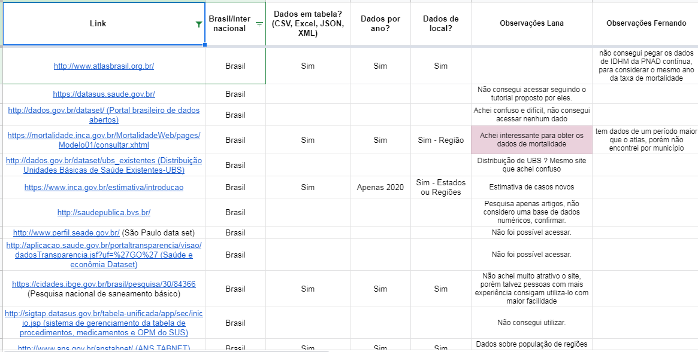
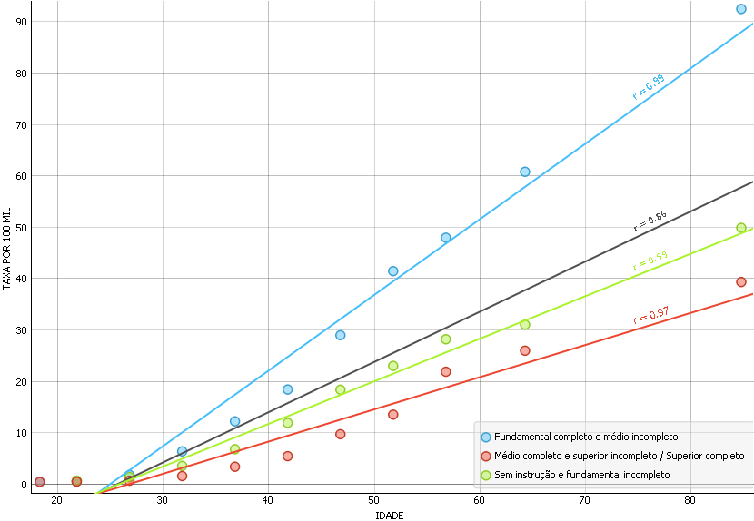

# Projeto: Ocupações, condições socioeconômicas e câncer de mama: estudo de correlação. 
# Project: Ocupations, socioeconomic conditions and breast cancer: correlation study

# Apresentação

O presente projeto foi originado no contexto das atividades da disciplina de pós-graduação [*Ciência e Visualização de Dados em Saúde*](https://github.com/datasci4health/home), oferecida no primeiro semestre de 2021, na Unicamp.

| Nome                           | RA        | Especialização |
|--------------------------------|-----------|----------------|
| Aline Borges                   | 210598    | Saúde          |
| Fátima Aparecida Tagliaferro   | 98918     | Computação     |
| Fernando Akune                 | 970709    | Computação     |
| Lana Soares                    | 209580    | Saúde          |

# Descrição Resumida do Projeto

O câncer é a principal causa de morte em países desenvolvidos e, segundo estimativas até o ano de 2030, será de 22,2 milhões de casos de câncer e 12,7 milhões de mortes no mundo, sendo que dois terços dos casos ocorrerão nos países pobres e em desenvolvimento como a principal causa de morbidade e mortalidade. O tipo de cancer que mais acomete brasileiras, representando em torno de 20,9% de todos os cânceres que afetam o sexo feminino ou 29,7%, excetuando-se o câncer de pele não melanoma, é o câncer de mama, uma doença causada pela multiplicação desordenada de células com alterações genicas que formam um tumor. De acordo com relatório elaborado pelo INCA, algumas ocupações (profissões) apresentam uma incidência maior deste tipo de câncer. As desigualdades em saúde refletem as desigualdades sociais. Embora mais aparentes nos estratos socioeconômicos desfavorecidos, as desigualdades em saúde operam através de toda a sociedade. Em relação ao câncer, as diferenças socioeconômicas se manifestam em diversos aspectos do seu perfil epidemiológico. Estudos nessa área representam uma abordagem essencial em epidemiologia e saúde pública, podendo contribuir para a identificação de fatores responsáveis por variações regionais dos níveis de saúde e para formulação de hipóteses a serem investigadas em futuras pesquisas. Dentro deste contexto, o presente trabalho teve como objetivo investigar associações entre idade, nível socioeconômico (anos de estudo), profissões (ocupação) e mortalidade por câncer de mama, através da análises de dados disponibilizados em bancos de acesso público.

# Vídeos do Projeto

## Vídeo da Proposta

https://youtu.be/DoauGouCxCo

## Vídeo da Apresentação Final
> Link para vídeo da apresentação final do projeto (máximo 8 minutos). *TODOS OS MEMBROS DO GRUPO DEVEM APARECER NO VÍDEO*.

# Slides do Projeto

## Slides da Proposta
> Link para slides de apresentação da proposta do projeto.

[Slides da Proposta](references/Slides_da_Proposta.pdf)

## Slides da Apresentação Final
> Link para slides da apresentação final do projeto.

# Introdução e Referenciais de Teóricos
> Contextualização do projeto

O câncer é a principal causa de morte em países desenvolvidos e, segundo estimativas até o ano de 2030, será de 22,2 milhões de casos de câncer e 12,7 milhões de mortes no mundo, sendo que dois terços dos casos ocorrerão nos países pobres e em desenvolvimento como a principal causa de morbidade e mortalidade. 
O tipo de cancer que mais acomete brasileiras, representando em torno de 20,9% de todos os cânceres que afetam o sexo feminino ou 29,7%, excetuando-se o câncer de pele não melanoma, é o câncer de mama, uma doença causada pela multiplicação desordenada de células com alterações genicas que formam um tumor. Existem diferentes tipos de câncer de mama, assim a doença pode evoluir de variadas formas, alguns de maneira acelerada, enquanto outros desenvolvem-se lentamente, isto se deve a características específicas e próprias de cada tumor. Apenas 1% do total de casos da doença acomete homens, não havendo uma única causa para seu surgimento. Os fatores como: envelhecimento, quanto mais idade, maior o risco de ter a doença, relacionados à vida reprodutiva da mulher (idade da primeira menstruação, ter tido ou não filhos, ter ou não amamentado, idade em que entrou na menopausa), histórico familiar de câncer de mama, consumo de álcool, excesso de peso, atividade física insuficiente e exposição à radiação ionizante, estão diretamente relacionados ao desenvolvimento da doença entre as mulheres  (INCA, 2020). 
Também a exposição a determinadas substâncias e ambientes, como agrotóxicos, benzeno, campos eletromagnéticos de baixa frequência, campos magnéticos, compostos orgânicos voláteis, hormônios e dioxinas poluentes orgânicos persistentes altamente tóxicos ao ambiente que são normalmente subprodutos de processos industriais e de combustão, podem estar associada ao desenvolvimento da doença. Os profissionais que apresentam risco aumentado de desenvolvimento de câncer de mama são os cabeleireiros, operadores de rádio e telefone, enfermeiros e auxiliares de enfermagem, comissários de bordo e trabalhadores noturnos. As atividades econômicas que mais se relacionam ao desenvolvimento da doença são as da indústria da borracha e plástico, química e refinação de petróleo (INCA, 2021). 
A falta de estrutura e investimento nos serviços de saúde, combinadas ao envelhecimento progressivo da população dotada de estilos de vida associados aos riscos de desenvolvimento do câncer, e os fatores contundentes às iniquidades sociais, corroboram à incongruência de que tanto a incidência como a mortalidade, mesmo com os avanços recentes no diagnóstico e tratamento do câncer, sigam aumentando nos países em desenvolvimento. Pode-se observar desigualdades dentro de um mesmo país, na carga de câncer como também entre países, através de modelos conceituais, relacionando fatores socioeconômicos e de estruturação dos serviços de saúde, com avaliações dos aspectos dos diferentes níveis de exposição a fatores de risco e de acesso a diagnóstico, tratamento e prevenção, que poderiam explicar as iniquidades na mortalidade por câncer entre os grupos socioeconômicos, étnicos e de gênero. Para melhor cobertura de dados e elucidação, variáveis como por exemplo, níveis de consumo de tabaco, os padrões da dieta, e as características reprodutivas, além da prevalência das infecções relacionadas ao câncer, são pontos muito relevantes mas que têm mudado rapidamente. Assim os estudos de transições demográficas e epidemiológicas contribuem imensamente para entender as mudanças no perfil de risco para as doenças crônicas como o câncer (BARBOSA, 2016).

> Caracterização do problema

As desigualdades em saúde operam através de toda a sociedade e refletem as desigualdades sociais, mais prevalentes nos estratos socioeconômicos desfavorecidos. As diferenças socioeconômicas se manifestam em diversos aspectos no perfil epidemiológico em relação ao câncer. Os grupos de níveis socioeconômicos mais baixos são os que apresentam maior incidência; maior proporção de diagnóstico tardio de neoplasias passíveis de detecção em estágios iniciais; maior dificuldade de acesso ao diagnóstico e tratamento adequado; pior prognóstico e menor sobrevida após o diagnóstico; evidências que demonstram o maior risco de óbito por câncer em geral e por tipos de câncer potencialmente curáveis. 
Análises de estudos ecológicos contribuem e estruturam uma abordagem essencial para a identificação de fatores responsáveis por variações regionais de níveis em saúde pública e epidemiológica, para formulação de hipóteses e interpretações a serem investigadas em futuras pesquisas. Porém devido a limitações, que se referem ao ajuste incompleto para variáveis de confusão e à falácia ecológica, esses estudos muitas vezes têm sido relegados a segundo plano e, no tocante à investigação das desigualdades sociais em câncer, seus resultados raramente têm sido incluídos em revisões sistemáticas, focalizadas que estão nos estudos de coorte e caso-controle (RIBEIRO E NARDOCCI, 2013).

> Motivação

A identificação de áreas ou grupos populacionais sob maior risco de mortalidade por câncer, serve de base informativa para o monitoramento do estado de saúde pública, para a identificação das populações de risco, planejamento, definição e implantação de políticas voltadas para áreas mais vulneráveis. Produzir estas análises permite relacionar os grupos em vantagem ou desvantagem social e quantificar as disparidades na mortalidade por câncer, assim estudos ecológicos que analisem os padrões sociais e econômicos são fundamentais para compreensão estrutural deste problema no Brasil e no mundo (BARBOSA, 2016 ).  O Ministério da Saúde destaca a carência de informações que permitam evidenciar os fatores de risco de câncer relacionados ao trabalho, assim como as dificuldades de se estabelecer um sistema de vigilância do câncer dos trabalhadores expostos e dos agentes cancerígenos (BOZA, 2012).

> Relevância

Apesar do substancial desenvolvimento econômico e social vivido pelo país nas últimas décadas, o Brasil está no ranking entre os países com as maiores desigualdades sociais e econômicas do mundo, e sob a administração do atual governo este desenvolvimento adquirido tem decaído gravemente, apontando retrocesso, uma vez que o censo demográfico nacional, ferramenta vital que retrata a situação do país para um desenvolvimento eficiente de políticas públicas e planejamento da infraestrutura da saúde, feito a cada dez anos pelo Instituto Brasileiro de Geografia e Estatística (IBGE) previsto para o ano de 2020, foi adiado, primeiramente devido à pandemia e em abril de 2021 anunciado o corte do congresso sancionado pelo presidente Jair Bolsonaro que não destina recursos para sua realização, o que torna escassas as fontes científicas e de confiabilidade de informações estatísticas e epidemiológicas (UOL, 2021). Assim, as profundas desigualdades sociais aliadas à falta de planejamento governamental abrangente do sistema de saúde têm exacerbado as iniquidades no acesso aos cuidados em saúde. A conjunção destes problemas é determinante na avaliação dos níveis de mortalidade por câncer, já que os casos fatais são influenciados pelo diagnóstico precoce e a disponibilidade de tratamentos e cuidados ao paciente (BARBOSA, 2016). A responsável pela Área de Vigilância do Câncer Relacionado ao Trabalho e ao Ambiente do Inca, Ubirani Otero, aponta que a dificuldade de se estabelecer uma relação entre o ambiente profissional e a doença faz com que o câncer ocupacional seja subdimensionado. (BOZA, 2012).

> Trabalhos relacionados

- Trabalho de Barbosa et al, 2016 - Foram analisados os óbitos por câncer ocorridos entre 2010 e 2012, obtidos no Sistema de Informação sobre Mortalidade. Foram selecionados 268 municípios brasileiros que apresentaram população acima de 80 mil habitantes e melhor qualidade de informação. Os indicadores socioeconômicos referentes ao ano 2000 foram extraídos do Atlas Brasil 2013. Para analisar a correlação entre indicadores socioeconômicos e a mortalidade por câncer foi utilizada a Correlação de Pearson e a regressão linear simples. Resultados: Verificou-se correlação negativa com o analfabetismo (r=-0,509) e com o Gini (r=-0,197); a correlação foi positiva com o indicador de renda (r=0,414) e esperança de vida (r=0,537); a regressão linear simples mostrou que há uma associação fraca entre a mortalidade por câncer e as variáveis socioeconômicas pesquisadas.
 
- Trabalho de Sakamoto et al, 2017 - O estudo analisou a influência dos índices socioeconômicos municipais nas taxas de mortalidade por câncer de boca e de orofaringe em idosos nas 645 cidades do Estado de São Paulo, Brasil. Dados secundários de óbitos foram obtidos no Sistema de Informações sobre Mortalidade do Ministério da Saúde. O número de idosos e os valores da renda média per capita e do Índice de Desenvolvimento Humano por município (IDH-M) foram obtidos de dados governamentais. A análise descritiva e exploratória dos dados foi realizada, seguida de modelos binomiais negativos descritos pelo procedimento PROC GENMOD e avaliados pelo AICc (Critério de Informação de Akaike corrigido), pelo grau de liberdade e pelo teste de Wald (α=0.05). O estudo concluiu que as desigualdades socioeconômicas das cidades influenciam nas taxas de mortalidade por CB e CO em idosos.

- Trabalho de Ribeiro e Nardocci, 2013 - O estudo teve como objetivo investigar associações entre nível socioeconômico e incidência e mortalidade por câncer e seus tipos, através de revisão de estudos ecológicos. As principais bases de dados regionais e internacionais foram pesquisadas na seleção de artigos em português, espanhol e inglês, publicados entre 1998 e 2008. Verificou-se associação positiva e consistente do nível socioeconômico da área de residência com incidência de câncer de próstata e mortalidade pelo de cólon nos homens, e com incidência e mortalidade por câncer de mama e mortalidade pelo de cólon nas mulheres. Associação consistente e negativa foi encontrada para incidência e mortalidade por cânceres de esôfago e estômago, para incidência dos de cólon e pulmão e mortalidade pelos de laringe e cavidade oral, nos homens, e para incidência e a mortalidade pelos de esôfago, estômago e colo uterino e para incidência dos de cólon e pulmão, nas mulheres. Apesar da presença de efeito residual de área e de viés relacionado à medida agregada de nível socioeconômico, estudos ecológicos podem ser eficientemente utilizados na mensuração das desigualdades socioeconômicas em câncer. Uso de pequenas unidades geográficas e de dados de registros de câncer em países em desenvolvimento pode contribuir para melhor conhecimento de suas desigualdades em saúde.

> Indicação (bastante resumida) da análise proposta

Visando preencher a lacuna de conhecimento em desigualdades sociais na mortalidade do câncer de mama, procedeu-se a tentativa de analisar dados disponibilizados através de bancos de acesso público, entre os anos X e Y, que tratam da relação entre o status socioeconômico e a mortalidade por câncer de mama. 
A ideia inicial da análise proposta era verificar se a renda ou a educação apresentavam alguma influência no desfecho do câncer de mama. Uma vez que a obtenção dos dados de pessoas curadas se demonstrou inviável, decidimos utilizar os dados referentes à mortalidade da doença.
As primeiras análises de IDH x taxa de mortalidade não indicaram correlação, então foram realizadas análises a partir de cada registro de óbito do ano de 2010. Considerando o artigo do INCA que cita as profissões com maior incidência de câncer, acrescentamos como objetivo a verificação da semelhança dos dados trazidos no artigo com os dados de mortalidade. A fim de tentar buscar alguma correlação com aspectos socieconomicos, realizamos um modelo de regressão usando as variáveis idade e escolaridade (agrupadas), uma vez que para cálculo da taxa por 100 mil, precisamos do número de óbitos da população em cada grupo.

> Indicação (bastante resumida) dos resultados alcançados

Foram obtidos dois resultados principais, o primeiro deles é uma tabela indicando a taxa de mortalidade por cem mil habitantes, para cada grupo de ocupações. Apesar das diferenças entre as tabelas de ocupações usadas nos registros dos óbitos e CENSO de 2010, foi possível agrupa-las de modo a alcançar as taxas. As ocupações que apresentaram as maiores taxas não coincidiram exatamente com o resultado do INCA, que mostra as profissões com maior incidência do câncer de mama, mas sugerem que existe uma diferença entre as atividades desempenhadas e/ou o ambiente de trabalho que explicam as diferentes taxas. Além disso, a desigualdade na renda entre ocupações, pode propiciar uma diferença na na qualidade do tratamento, após o diagnóstico da doença. Um exemplo disso talvez seja o caso da comissária de bordo, que aparece no levantamento do INCA como sendo de alto risco de incidência do câncer de mama, porém não teve nenhum registro de óbito por essa causa em 2010. Isso não significa necessariamente que não tiveram mortes por câncer de mama entre essas profisisonais em 2010, pois a profissão de um falecido pode ser omitida no registro ou indicada de maneira imprecisa.

O segundo resultado vem do modelo de regressão linear, considerando as variáveis idade e escolaridade. A escolaridade sozinha não é capaz de explicar a variação nas taxas de mortalidade, mas combinada com a idade, atingiu um resultado ligeiramente superior ao modelo utilizando somente a idade. Pelo gráfico TAXA x IDADE foi possível observar uma certa separação entre os grupos de escolaridade. A hipótese aqui também é que as mulheres com nível de instrução mais alto tendem a ocupar colocações com maior renda, impactando indiretamente na qualidade do tratamento e desfecho da doença. Uma investigação mais aprofundada, incluindo dados de renda, acesso a planos de saúde privados, outros anos, etc. são necessários para obter um resultado estatisticamente sigficativo, pois são muitas as variáveis (não somente as socienconômicas) que influem da evolução dessa doença tão complexa.

# Perguntas de Pesquisa
* A condição socioeconômica do paciente impacta no desfecho do tratamento de câncer de mama?
* Existe uma correlação entre a mortalidade por câncer de mama com determinadas profissões?

# Objetivos do Projeto
> Como seu projeto propôs abordar o problema apresentado.

O objetivo deste projeto foi investigar associações entre idade, nível socioeconômico (anos de estudo), profissões (ocupação) e mortalidade por câncer de mama, através da análises de dados disponibilizados em bancos de acesso público.

# Metodologia
> Abordagem adotada pelo projeto na busca pela resposta às perguntas de pesquisa.
> Justificar teoricamente, sempre que possível, a metodologia adotada. 

Procurou-se usar nesse projeto a metodologia *CRISP-DM (CRoss-Industry Standard Process for Data Mining)*, que de forma breve possui os seguintes passos: entendimento do negócio, entendimento dos dados, preparação dos dados, modelagem, avaliação e divulgação. Entretanto, relatórios não foram produzidos da maneira detalhada em cada etapa dessa metodologia.

Partindo da primeira pegunta de pesquisa, se existe relação entre a condição socioeconômica e a mortalidade do câncer de mama, foram buscadas uma série de bases que pudessem trazer dados (mortalidade, índice de desenvolvimento humano, renda per capita, escolaridade, etc.) que permitissem análises nesse sentido.

Grande parte do trabalho da pesquisa foi no entendimento dos dados, pois algumas bases encontradas são bastante ricas em detalhes, com o Sistema de Informações de Mortalidade (SIM), disponibilizado pela Fiocruz e que possui mais de cem dados sobre todos os registros de óbitos no país. Entender como a ocupação das pessoas foi relatada nesses registros e a evolução da classificação das ocupações até chegar na tabela utilizada pelo CENSO de 2010, é um exemplo do desafio nessa etapa.

A preparação dos dados foi fundamental porque a partir dos registros de óbitos individualizados criou-se a necessidade de obter a população total em cada grupo, de ocupação, idade ou escolaridade, para calcular da taxa de mortalidade (normalização), antes de compara-los.

Na etapa de modelagem, uma regressão linear múltipla foi usada para procurar explicar a influência de cada variável nas taxas de mortalidade. A avaliação foi feita através da medida do coeficiente de determinação (R2).

Por fim, a divulgação está sendo feita aqui, incluindo todos os scripts e arquivos de dados necessários para reprodução dos resultados.

## Bases de Dados e Evolução

Listamos aqui bases de dados iniciais, candidatas à nossa pesquisa. 

### Brasil

https://datasus.saude.gov.br/

http://dados.gov.br/dataset/ (Portal brasileiro de dados abertos)

https://mortalidade.inca.gov.br/MortalidadeWeb/pages/Modelo01/consultar.xhtml 

http://dados.gov.br/dataset/anvisa-preco-de-medicamento-consumidor (Preço remédio dataset)

http://dados.gov.br/dataset/ubs_existentes (Distribuição Unidades Básicas de Saúde Existentes-UBS)

https://www.inca.gov.br/estimativa/introducao 

http://saudepublica.bvs.br/

http://www.perfil.seade.gov.br/ (São Paulo data set)

http://aplicacao.saude.gov.br/portaltransparencia/visao/dadosTransparencia.jsf?uf=%27GO%27 (Saúde e econômia Dataset)

https://cidades.ibge.gov.br/brasil/pesquisa/30/84366 (Pesquisa nacional de saneamento básico)

http://sigtap.datasus.gov.br/tabela-unificada/app/sec/inicio.jsp (sistema de gerenciamento da tabela de procedimentos, medicamentos e OPM do SUS)

http://www.ans.gov.br/anstabnet/ (ANS TABNET)

http://www.atlasbrasil.org.br/

https://www.inca.gov.br/sites/ufu.sti.inca.local/files//media/document//cancer-in-brazil-vol4-2013.pdf (pdf mas com tabelas por estado)

https://bigdata.icict.fiocruz.br/ (Plataforma de Ciência de Dados aplicada à saúde)

https://bvsalud.org/ (Biblioteca virtual de saúde)

https://mtci.bvsalud.org/pt/

### Internacional

https://data.world/dartmouthatlas/cancer-patients-death (mortalidade por estado nos EUA) 

https://data.mendeley.com/datasets (Mendeley Data Repository)

https://virtualpatients.eu/ (Eletronic virtual pacients)

https://virtualpatients.eu/referatory/ (Referatory)

https://www.nlm.nih.gov/mesh/meshhome.html (Medical Subject Headings (MeSH))

https://www.cancerimagingarchive.net/collections/ (Cancer Imaging Archive)

https://datascience.cancer.gov/resources/nci-data-catalog#drugdiscovery (National cancer Institute Data Catalog)

https://www.scielo.br/scielo.php?script=sci_arttext&pid=S0482-50042017000600574 (Scielo)

http://www.diseasesdatabase.com/begin.asp (Diseases Database)

https://seer.cancer.gov/canques/ (National Cancer Institute - Cancer Query Systems)

https://seer.cancer.gov/ (All Cancer Sites Combined Database)

http://portals.broadinstitute.org/cgi-bin/cancer/datasets.cgi (Cancer Program Datasets)

https://toxnet.nlm.nih.gov/cgi-bin/sis/htmlgen?CCRIS (CCRIS)

https://www.cdc.gov/cancer/dcpc/data/ (Cancer Data and Statistics)

https://portal.gdc.cancer.gov/ (GDC Data Portal - National Cancer Institute)

https://data.gov.uk (Find Open Data)

https://apps.who.int/nha/database/Select/Indicators/en (Global Health Expenditure DB(WHO))

https://datacatalog.worldbank.org/dataset/universal-health-coverage-global-monitoring-data-
2017 (Universal Health Coverage Global Monitoring Data - 2017)

https://datacatalog.worldbank.org/dataset/world-development-indicators (World Developmnet indicatos)

https://www.outbreak-database.com/Home.aspx (Outbreak database)

https://ilostat.ilo.org/ (ILOSTAT)

http://datatopics.worldbank.org/ (Datatopics - World Bank)

https://www.br.undp.org/content/brazil/pt/home/idh0/rankings/idh-global.html

https://www.who.int/data/data-collection-tools/who-mortality-database 

### Levantamento de Bases de dados

Em um primeiro momento, realizou-se a pesquisa e o levantamento de bases de dados que poderiam ser utilizadas. Foi elaborada uma tabela para facilitar a visualização e seleção das bases com maior potencial de utilização, contendo os seguintes campos:

* Link para a base de dados
* Classificação em bases nacionais e internacionais
* Se os dados estavam disponíveis em tabelas (CSV, Excel, JSON, XML)
* Se o banco continha dados por ano
* Se o banco continha dados por localização
* Campos de observação a serem preenchidos com a primeira impressão dos participantes do grupo em relação às bases de dados

Até este momento, cerca de 42 bases de dados haviam sido sugeridas para análise de viabilidade de utilização (Figura 1).

Figura 1 - Pré seleção de bases para análise de viabilidade de utilização

Após a delimitação do estudo a nível nacional, descartou-se a utilização de bases internacionais, focando na pré-análise mais detalhada das bases de dados brasileiras (Figura 2).

Figura 2 - Pré-análise e seleção das bases de dados nacionais utilizadas

Durante essa etapa, 4 bases de dados foram escolhidas para estudo, estando descritas nas seções seguintes.

### Bases Estudadas mas Não Adotadas

Base de Dados | Endereço na Web | Resumo descritivo
----- | ----- | -----
Atlas do Desenvolvimento Humano no Brasil | http://www.atlasbrasil.org.br/ | Retrato do desenvolvimento humano e as desigualdades no Brasil, combinando dados como IDHM, IDHM Renda, IDHM Longevidade, IDHM Educação e taxa de mortalidade de mulheres por câncer de mama. Permite a visualização/download dos dados por estados e municípios entre outras.

> Faça uma descrição sobre o que concluiu sobre esta base. Sugere-se que respondam perguntas ou forneçam informações indicadas a seguir:

> * O que descobriu sobre esse banco?

O site retrata o desenvolvimento humano e as desigualdades no Brasil, combinando dados de qualidade com formas amigáveis de visualização. A utilização da plataforma é muito simples: após seleção da territorialidade e do indicador, é possível realizar o download dos dados no formato de uma planilha excel, que posteriormente foi convertida para .CSV para utilização no Orange.

> * Quais as transformações e tratamentos (e.g., dados faltantes e limpeza) feitos?

Levando em conta dados gerados em 2016 pelo Coeficiente de Gini, instrumento para medir o grau de concentração de renda em determinado grupo, selecionamos o estado de Pernambuco, que apresentava uma das maiores taxas de desigualdade social no país. Dados relacionados à taxa de mortalidade estão disponíveis no período de 2013 a 2017. Entretanto, dada a ausência de dados da Pesquisa Nacional por Amostra de Domicílios  (PNAD) detalhados por município, escolheu-se utilizar os valores do Censo de 2010 e a taxa de 2013. Observou-se que para cinco municípios a taxa de mortalidade apareceu em branco.

> * Por que este banco não foi adotado?

O banco não foi adotado dada a ausência de dados individualizados, que dificultam a busca pela relação entre renda/educação com a mortalidade da doença. Os dados de IDH apresentados estão a nível municipal, sendo assim é possível que os populares de uma mesma cidade, que faleceram por câncer de mama, apresentem realidades socioeconômicas completamente distintas entre si.

> * Apresente aqui uma Análise Exploratória (inicial) sobre esta base.

A análise exploratória inicial foi realizada através da ferramenta Orange. Depois de importar a planilha do estado de PE, utilizou-se a função Feature Statistics para verificar os padrões de distribuição e os dados faltantes, conforme demonstrado na Figura 3.

Figura 3 - Observação da distribuição e dos dados faltantes através da função Feature Statistics, na ferramenta Orange

Em seguida, através da função Scatter Plot foi possível observar os gráficos de dispersão, que sugerem ausência de correlação entre IDHM e mortalidade (r=0,15), conforme Figura 4.

Figura 4 - Gráfico de dispersão observado para IDHM e Mortalidade, através da função Scatter Plot

Base de Dados | Endereço na Web | Resumo descritivo
----- | ----- | -----
Classificação Brasileira de Ocupações - CBO 2002  (MTE) | http://www.mtecbo.gov.br/cbosite/pages/downloads.jsf | Documento que retrata a realidade das profissões do mercado de trabalho brasileiro. Seus dados alimentam as bases estatísticas de trabalho e servem de subsídio para a formulação de políticas públicas de emprego.

> Faça uma descrição sobre o que concluiu sobre esta base. Sugere-se que respondam perguntas ou forneçam informações indicadas a seguir:

> * O que descobriu sobre esse banco?

Através deste banco de dados foi possível identificar o código e descrição de todas as ocupações existentes no país reconhecidas pelo MTE.

> * Quais as transformações e tratamentos (e.g., dados faltantes e limpeza) feitos?

Não foram necessárias transformações por tratar-se de uma tabela simples, apenas com código e descrição.

> * Por que este banco não foi adotado?

Essa tabela não foi adotada porque posteriormente foi encontrada outra contendo o código CIUO88, além código e título da CBO 2002.

> * Apresente aqui uma Análise Exploratória (inicial) sobre esta base.

Trata-se de uma tabela com o código e a descrição das ocupações, assim não houve necessidade de uma análise exploratória.

### Bases Estudadas e Adotadas

> Para cada base, coloque uma mini-tabela no modelo a seguir e depois detalhamento sobre como ela foi analisada/usada, conforme exemplo a seguir.

Base de Dados | Endereço na Web | Resumo descritivo
----- | ----- | -----
Sistema de Informações de Mortalidade - SIM 1996-2016 (Fiocruz) | https://bigdata-metadados.icict.fiocruz.br/dataset/sistema-de-informacoes-de-mortalidade-sim | Reunidos pela Plataforma de Ciência de Dados aplicada à Saúde (PCDaS), os dados foram obtidos junto ao DATASUS (Ministério da Saúde), resultando em um dataset anual com todos os registros das declarações de óbito a partir de 1996.

> Faça uma descrição sobre o que concluiu sobre esta base. Sugere-se que respondam perguntas ou forneçam informações indicadas a seguir:
> * Qual o esquema/dicionário desse banco (o formato é livre)?

A base SIM (Sistema de Informações de Mortalidade) possui 165 colunas (https://bigdata-metadados.icict.fiocruz.br/dataset/sistema-de-informacoes-de-mortalidade-sim/resource/d6285f2a-576b-4666-aa63-0b00f7dfeff6). As que aparecem com nomes em MAIÚSCULO representam dados originais advindos do DATASUS e colunas com nomes iniciando em minúsculo representam dados resultantes de transformação ou enriquecimento. Nas análises foram utilizadas as seguintes colunas:

| Coluna                           | Tipo        | Descrição                                                                      |
|----------------------------------|-------------|--------------------------------------------------------------------------------|
| idade_obito_anos                 | numérico    | Idade do óbito (em anos) informada na declaração de óbito                      |
| def_sexo                         | texto       | Sexo (Nominal, com as seguintes classificações: Masculino; Feminino; Ignorado) |
| OCUP                             | numérico    | Ocupação, conforme a Classificação Brasileira de Ocupações (CBO-2002)          |
| causabas_categoria               | texto       | Categoria CID-10 da causa base do óbito                                        |
| ESC2010                          | numérico    | Escolaridade 2010. Valores: 0 – Sem escolaridade; 1 – FundamentalI (1a a 4a série); 2 – Fundamental II (5a a 8a série); 3 – Médio(antigo 2o Grau); 4 – Superior incompleto; 5 – Superior completo; 9– Ignorado.|
| ESCFALAGR1                       | texto       | Escolaridade 2010 agregada. Valores: 00 – Sem Escolaridade; 01 –Fundamental I Incompleto; 02 – Fundamental I Completo; 03 –Fundamental II Incompleto; 04 – Fundamental II Completo; 05 –Ensino Médio Incompleto; 06 – Ensino Médio Completo; 07 –Superior Incompleto; 08 – Superior Completo; 09 – Ignorado; 10 –Fundamental I Incompleto ou Inespecífico; 11 – Fundamental II Incompleto ou Inespecífico; 12 – Ensino Médio Incompleto ou Inespecífico.|
| def_escol                        | texto       | Escolaridade (Nominal, com as seguintes classificações: Nenhuma; de 1 a 3 anos; de 4 a 7 anos; de 8 a 11 anos; 12 e mais; Ignorado) |

> * O que descobriu sobre esse banco?

O banco de dados fornece com riqueza de detalhes informações sobre todos os registros das declarações de óbitos, de 1996 a 2016. Algumas das informações que podem ser consultadas são: data do óbito, sexo, causa base do óbito (CID), ocupação formal conforme a CBO, entre outras.

> * Quais as transformações e tratamentos (e.g., dados faltantes e limpeza) feitos?

Após realizar o download do arquivo referente ao ano de 2010, foram configurarados os tipos apenas das colunas de interesse, para evitar erros de conversão durante a importação na ferramenta Orange. De um total de 1.136.947 registros de óbitos, foram obtidos 487.137 ao filtrar o sexo feminino. Obteve-se 12.705 registros após filtrar os óbitos causados por Neoplasias Malignas da Mama (CID-10 = C50). A figura a seguir mostra as distribuições das variáveis e indica a falta do valor do campo ocupação para 2.041 (16%) registros.

Após realizar os filtros, os registros foram agrupados de acordo com objetivo da análise, ou seja, por ocupação, escolaridade e faixa etária.

> * Apresente aqui uma Análise Exploratória (inicial) sobre esta base.

Para os códigos de OCUP 999992 e 999993 não foram encontradas as descrições correspondentes na base CBO 2002, sendo assim foram retirados da análise por ocupação. Para calcular a taxa de mortalidade de cada ocupação por 100 mil habitantes, inicialmente pensou-se em utilizar os dados da RAIS (Relação Anual de Informações Sociais), porém seria necessário deixar de fora os trabalhadores informais. 
Com a disponibilidade da tabela “1.1.11 - Pessoas de 10 anos ou mais de idade, ocupadas na semana de referência, por situação do domicílio e sexo, segundo os grandes grupos, os subgrupos principais, os subgrupos e os grupos de base de ocupação no trabalho principal” do Censo 2010, reavaliou-se tratar como base os registros dos óbitos de 2010 da base SIM pois contem os dados referentes ao mesmo ano. Usando a tabela Tabela 1.1.11 do Censo, o número de mulheres em cada uma das ocupações foi preenchido e por fim a taxa por cem mil calculada.

Para a análise de escolaridade, verificou-se que as colunas ESC2010 e ESCFALAGR1 estavam sem valores, portanto, somente def_escol foi utilizada. Os 3.175 registros (25%) com valor 'Ignorado' no campo def_escol foram desconsiderados nessa análise. A distribuição dos valores aparece detalhada na figura abaixo.

Base de Dados | Endereço na Web | Resumo descritivo
----- | ----- | -----
Censo 2010 (IBGE) | https://censo2010.ibge.gov.br/ | Conjunto das operações que consistem em recolher, agrupar e publicar dados demográficos, econômicos e sociais relativos a um momento determinado ou em certos períodos, a todos os habitantes de um país ou território para o levantamento de informações sobre a população do país e sua condição de vida.

> Faça uma descrição sobre o que concluiu sobre esta base. Sugere-se que respondam perguntas ou forneçam informações indicadas a seguir:
> * Qual o esquema/dicionário desse banco (o formato é livre)?

A Tabela 3592 - Pessoas de 10 anos ou mais de idade, ocupadas na semana de referência, por sexo, segundo os grandes grupos, subgrupos principais, subgrupos e grupos de base da ocupação no trabalho principal, apresenta o seguinte esquema/dicionário.

| Coluna                           | Tipo        | Descrição                                                                                          |
|----------------------------------|-------------|----------------------------------------------------------------------------------------------------|
| Grandes grupos, subgrupos principais, subgrupos e grupos de base da ocupação no trabalho principal   | texto       | Código e descrição dos grupos de ocupação |
| Total                            | numérico    | Pessoas de 10 anos ou mais de idade, ocupadas                                                      |
| Homens                           | numérico    | Homens de 10 anos ou mais de idade, ocupados                                                       |
| Mulheres                         | numérico    | Mulheres de 10 anos ou mais de idade, ocupadas                                                     |

A Tabela 1.1.11 - Pessoas de 10 anos ou mais de idade, por nível de instrução, segundo o sexo e os grupos de idade - Brasil - 2010, foi gerada com a estrutura a seguir.

| Coluna                           | Tipo        | Descrição                                                                                          |
|----------------------------------|-------------|----------------------------------------------------------------------------------------------------|
| nível de instrução                | texto      | Valores: Sem instrução e fundamental incompleto, Fundamental completo e médio incompleto, Médio completo e superior incompleto, Superior completo e Não determinado  |
| grupo de idade                   | texto       | Valores: 10 a 13 anos, 14, 15 a 17, 18 ou 19, 20 a 24, 25 a 29, 30 a 34, 35 a 39, 40 a 44, 45 a 49, 50 a 54, 55 a 59, 60 a 69, 70 anos ou mais |                                                      |
| Número de Pessoas (Mulheres)     | numérico    | Mulheres de 10 anos ou mais de idade                                                               |

> * O que descobriu sobre esse banco?

O banco de dados fornece informações sobre todas as etapas do Censo 2010, incluindo tabelas como a 3592 - Pessoas de 10 anos ou mais de idade, ocupadas na semana de referência, por situação do domicílio e sexo, segundo os grandes grupos, os subgrupos principais, os subgrupos e os grupos de base de ocupação no trabalho principal. Essa tabela pode ser gerada no site escolhendo-se as variáveis, no caso apenas sexo foi selecionada. A Classificação de Ocupações para Pesquisas Domiciliares implantada no Censo Demográfico de 2010 tem compatibilidade com a CIUO-08 (*Clasificación Internacional Uniforme de Ocupaciones*) no nível mais desagregado (4 dígitos) em 8 dos 10 Grandes Grupos.

> * Quais as transformações e tratamentos (e.g., dados faltantes e limpeza) feitos?

Foi necessário um *script* Python, presente no componente merge do *workflow* para separar o código da descrição da ocupação. Além disso, somente as linhas referentes ao grupo de base, nível de detalhe mínimo, foram consideradas.

No caso da Tabela 1.1.11, obtida pelo *site* no formato de planilha eletrônica (.xls), foi necessário salvar o conteúdo como texto no formato *Comma Separated Values* (.csv).

> * Apresente aqui uma Análise Exploratória (inicial) sobre esta base.

Após as transformações e tratamentos, a Tabela 3592 resultou em 434 registros de ocupação, totalizando uma população de 33.810.209 mulheres. A tabela abaixo mostra as três ocupações com os menores e maiores números de mulheres ocupadas.

| Mulheres  | Codigo grupo | Descrição grupo                                 |
|-----------|--------------|-------------------------------------------------| 
|         9 |	        3151 | Oficiais maquinistas em navegação               | 
|        24 |         6224 | Caçadores                                       |
|        24 |         7541 | Trabalhadores subaquáticos                      | 
| 1.293.029	|         4110 | Escriturários gerais                            |
| 2.084.668	|         5223 | Balconistas e vendedores de lojas               |
| 4.671.204	|         9111 | Trabalhadores dos serviços domésticos em geral  |

O total da população femina na tabela 1.1.11 é igual a 83.223.618, destas, somente 514.562 (0,62%) aparecem com nível de instrução não determinado. O gráfico a seguir procurar mostrar como estão distrubuídas de acordo com os grupos de escolaridade.

Base de Dados | Endereço na Web | Resumo descritivo
----- | ----- | -----
RelatorioTabuaCBO2002_CBO94_CIUO88 | https://www.mtecbo.gov.br/cbosite/pages/tabua/FiltroConversao_CBO2002_CBO94_CIUO88.jsf | Tábua de Conversão CBO2002 - CBO94 - CIUO88

> * Qual o esquema/dicionário desse banco (o formato é livre)?

| Coluna          | Tipo        | Descrição                                                                               |
|-----------------|-------------|-----------------------------------------------------------------------------------------|
| CBO2002         | texto       | Código da ocupação                                                                      |
| Título CBO2002  | texto       | Descrição da ocupação                                                                   |
| CBO94           | texto       | Código da ocupação pela tabela de 94                                                    |
| CIUO88          | numérico    | Código da ocupação pela CIUO-88 (*Clasificación Internacional Uniforme de Ocupaciones*) |

> * O que descobriu sobre esse banco?

A Classificação Brasileira de Ocupações de 2002 (CBO2002), gerida pelo Ministério do Trabalho e Emprego - MTE, usou como referência a *Clasificación Internacional Uniforme de Ocupaciones* 88 (CIUO88), que por sua vez, é elaborada pela Organização Internacional do Trabalho - OIT. Essa tabela permite descobrir o código CIUO88 de uma ocupação, a partir do CBO2002.

> * Quais as transformações e tratamentos (e.g., dados faltantes e limpeza) feitos?

Como o arquivo é gerado pelo *site* no formato *Portable Document Format* (.pdf), foi necessário copiar o conteúdo para um arquivo texto no formato *Comma Separated Values* (.csv).

> * Apresente aqui uma Análise Exploratória (inicial) sobre esta base.

Em 23 (1%) das 1.389 observações, o valor da coluna CIUO88 estava faltando e foram deixadas de fora das análises.  

Base de Dados | Endereço na Web | Resumo descritivo
----- | ----- | -----
corrtab88-08 | https://www.ilo.org/public/spanish/bureau/stat/isco/docs/corrtab08-88.xls | Tábua de Conversão CIUO88 - CIUO08

> * Qual o esquema/dicionário desse banco (o formato é livre)?

| Coluna             | Tipo        | Descrição                              |
|--------------------|-------------|----------------------------------------|
| Level              | texto       | Nível do grupo                         |
| CIUO-88 Título SP  | texto       | Descrição da ocupação pela CIUO-88     |
| Código CIUO-88     | numérico    | Código da ocupação pela CIUO-88        |
| Código CIUO-08     | numérico    | Código da ocupação pela CIUO-08        |
| CIUO-08 parte      | texto       |                                        |
| CIUO-08 Título SP  | texto       | Descrição da ocupação pela CIUO-08     |
 
> * O que descobriu sobre esse banco?

A CIOU vem sendo revisada para acompanhar a evolução no mundo do trabalho e em 2007 a OIT divulgou uma atualização, denomindada CIUO-08.

> * Quais as transformações e tratamentos (e.g., dados faltantes e limpeza) feitos?

Como o arquivo é gerado pelo *site* no formato de planilha eletrônica (.xls), foi necessário salvar o conteúdo como texto no formato *Comma Separated Values* (.csv).

> * Apresente aqui uma Análise Exploratória (inicial) sobre esta base.

Apenas uma das 674 observação estava sem os valores para os campos Código CIUO-88 e Código CIUO-08 e foi deixada de fora das análises. 

### Integração entre Bases e Análise Exploratória

> Descreva etapas de integração de fontes de dados e apresente a seguir uma análise exploratória que envolva ambas.

No *script* Python, do componente merge do *workflow*, foi feita a integração entre a base dos óbitos agrupados por ocupação, RelatorioTabuaCBO2002_CBO94_CIUO88, corrtab88-08 e a tabela 3592. O objetivo foi obter a população referente a cada código de ocupação, fazendo a junção dessas tabelas seguindo a sequência dos campos OCUP, CBO2002, CIUO88, Código CIUO-88, Código CIUO-08 e Código do grupo (Tabela 3592). Um problema surgido nessa etapa foi que o relacionamento entre essas tabelas é do tipo muitos para muitos, gerando situações como no exemplo mostrado abaixo.

| CBO2002	| Título CBO2002	                              | Código CIUO-88 |	Código CIUO-08 |	Descrição do grupo de ocupação |
| --------|----------------------------------------------|----------------|----------------|--------------------------------|
| 212405	 | Analista de desenvolvimento de sistemas	     | 2131	| 2511	| Analistas de sistemas |
| 212405	 | Analista de desenvolvimento de sistemas	     | 2131	|	2512	|	Desenvolvedores de programas e aplicativos (software) |
| 212405  |	Analista de desenvolvimento de sistemas	     | 2131	|	2513	|	Desenvolvedores de páginas de internet (web) e multimídia |
| 212405	 | Analista de desenvolvimento de sistemas	     | 2131	|	2519	|	Desenvolvedores e analistas de programas e aplicativos (software) e multimídia não classificados anteriormente |
| 212405  |	Analista de desenvolvimento de sistemas	     |	2131	|	2521	|	Desenhistas e administradores de bases de dados |
| 212405  |	Analista de desenvolvimento de sistemas	     |	2131	|	2522	|	Administradores de sistemas |
| 212405  |	Analista de desenvolvimento de sistemas	     |	2131	|	2523	|	Profissionais em rede de computadores |
| 212405  |	Analista de desenvolvimento de sistemas	     |	2131	|	2529	|	Especialistas em base de dados e em redes de computadores não classificados anteriormente |
| 212410  |	Analista de redes e de comunicação de dados	 | 2131	|	2511	|	Analistas de sistemas |
| 212410  |	Analista de redes e de comunicação de dados	 |	2131	|	2512	|	Desenvolvedores de programas e aplicativos (software) |
| 212410  |	Analista de redes e de comunicação de dados	 |	2131	|	2513	|	Desenvolvedores de páginas de internet (web) e multimídia |
| 212410  |	Analista de redes e de comunicação de dados	 |	2131	|	2519	|	Desenvolvedores e analistas de programas e aplicativos (software) e multimídia não classificados anteriormente |
| 212410  |	Analista de redes e de comunicação de dados	 |	2131	|	2521	|	Desenhistas e administradores de bases de dados |
| 212410  |	Analista de redes e de comunicação de dados	 |	2131	|	2522	|	Administradores de sistemas |
| 212410  |	Analista de redes e de comunicação de dados	 |	2131	|	2523	|	Profissionais em rede de computadores |
| 212410  |	Analista de redes e de comunicação de dados	 |	2131	|	2529	|	Especialistas em base de dados e em redes de computadores não classificados anteriormente |
| 212420  |	Analista de suporte computacional            |	2131	|	2511	|	Analistas de sistemas |
| 212420  |	Analista de suporte computacional            |	2131	|	2512	|	Desenvolvedores de programas e aplicativos (software) |
| 212420  |	Analista de suporte computacional            |	2131	|	2513	|	Desenvolvedores de páginas de internet (web) e multimídia |
| 212420  |	Analista de suporte computacional            |	2131	|	2519	|	Desenvolvedores e analistas de programas e aplicativos (software) e multimídia não classificados anteriormente |
| 212420  |	Analista de suporte computacional            |	2131	|	2521	|	Desenhistas e administradores de bases de dados |
| 212420  |	Analista de suporte computacional            |	2131	|	2522	|	Administradores de sistemas |
| 212420  |	Analista de suporte computacional            |	2131	|	2523	|	Profissionais em rede de computadores |
| 212420  |	Analista de suporte computacional            |	2131	|	2529	|	Especialistas em base de dados e em redes de computadores não classificados anteriormente |

O Código CIUO-88 2131 referente a *Creadores y analistas de sistemas informáticos* tem três correnspondentes na CBO2002: 212405-Analista de desenvolvimento de sistemas, 212410-Analista de redes e de comunicação de dados e 212420-Analista de suporte computacional. Na revisão 2007, essa categoria foi desmembrada em oito ocupações diferentes, listadas na tabela acima. Para contornar essas situações, todas as ocupações foram agrupadas em conjuntos disjuntos, totalizando 96 grupos.

Como os valores das opções do campo def_escol da base SIM 2010 são diferentes da classificação adotada pela coluna nível de instrução da Tabela 1.1.11, as faixas foram agrupadas de acordo o a tabela a seguir.

| cod grupo | def_escol   | nível de instrução                                       |
|---------- |-------------|----------------------------------------------------------|
| 1         | Nenhuma     |  Sem instrução e fundamental incompleto                  |
| 1         | 1 a 3 anos  |  Sem instrução e fundamental incompleto                  | 
| 1         | 4 a 7 anos  |  Sem instrução e fundamental incompleto                  |
| 2         | 8 a 11 anos |  Fundamental completo e médio incompleto                 |   
| 3         | 12 e mais   |  Médio completo e superior incompleto / Superior completo| 
| (não considerado) | Ignorado    |  Não determinado                                         |

Uma vez que um dos propósitos deste trabalho é observar se existe uma correlação entre a mortalidade por câncer de mama com determinadas profissões realizou-se a análise exploratória das bases escolhidas para determinação das etapas de integração.

Com base nas informações apresentadas pelo artigo “As profissões e o Câncer” publicado pelo Instituto Nacional do Cancer (INCA, 2012) em https://www.inca.gov.br/sites/ufu.sti.inca.local/files//media/document//vigilancia-rede-cancer-17.pdf, aponta-se a hipótese de que 19 tipos de tumores malignos podem ter relação com determinadas profissões, dentre estes destacou-se como interesse ao grupo, a neoplasia maligna da mama (CID 10 - C50) para o intuito de avaliar a existencia de uma mortalidade maior em alguma das profissões listadas como de alto risco para desenvolvimento da doença, conforme demonstrado na figura abaixo.

Figura 8 - Agentes que podem desencadear a doença e profissões com maior predisposição para desenvolvimento do câncer de mama, de acordo com INCA 2012

Figura 9 - Workflow para análise do banco de dados de 2010

# Análises Realizadas
> Descrição detalhada das análises realizadas.

Foram realizadas duas etapas de análise.

1) Análise das ocupações com maior mortalidade

Embasados pelo artigo do INCA que descreve as ocupações com maior incidência de cancer de mama, realizou-se através da base de dados SIM 2010 e da bases Classificação Brasileira de Ocupações de 2002 (CBO2002), gerida pelo Ministério do Trabalho e Emprego - MTE, que utilizou como referência a *Clasificación Internacional Uniforme de Ocupaciones* 88 (CIUO88), elaborada pela Organização Internacional do Trabalho - OIT. Essa tabela permite descobrir o código CIUO88 de uma ocupação, a partir do CBO2002 de informação sobre a ocupação, análise da mortalidade por cancer de mama em função da ocupação relatada no registro de óbito de cada indivíduo.

O rank das taxas de mortalidade por grupo de ocupação aparecem na tabela 1 dos resultados. Uma linha foi adicionada para mostrar o total da população e óbitos considerados nessa análise, resultando em uma taxa de mortalidade de **8,93** por cem mil mulheres. A interpretação desse resultado deve ser feita com cautela, pois os números representam 20,83% de todos óbitos por câncer de mama e 42,56% da população feminina com idade maior ou igual a 18 anos. Essa limitação do estudo foi provocada pela ausência da informação da ocupação no registro do óbito ou falta de corresponência nas tabelas CBO2002/CIUO88/CIUO08. O grupo com a maior taxa de mortalidade, "Trabalhadores subaquáticos", que engloba as ocupações de "pescador artesanal de água doce" e "mergulhador profissional (raso e profundo)", registrou uma população de apenas 24 mulheres e 5 óbitos em 2010. 

No outro extremo da tabela, o grupo de professores do ensino fundamental tem uma população feminina bastante grande, porém um número de óbitos muito baixo, devido a conversão pela tabelas CBO2002/CIUO88/CIUO08 que leva esse grupo às ocupações de "Professor de ciências exatas e naturais do ensino fundamental", "Professor de história do ensino fundamental", "Professor de língua portuguesa do ensino fundamental" e "Professor de matemática do ensino fundamental". Parte dos óbitos das professoras do ensino fundamental pode ter sido registrada como "Professor de nível superior do ensino fundamental (primeira a quarta série)", que faz parte do grupo "Professores do ensino pré-escolar", o qual apresenta uma taxa bem acima do valor geral.

Apesar dessas limitações, a tabela indica taxas acima da média nacional para ocupações como cabelereiras e profissionais de enfermagem, alinhada com o levantamento que aponta essas profissões como sendo de alto risco para o desenvolvimento do câncer de mama. Não foi possível obter dados de renda para completar a análise econômica, contudo, o aparecimento de ocupações com rendimentos mais altas, na parte de cima e de baixo da tabela, indicam a dificuldade de mostrar a rende como fator determinante para a taxa.  

2) Análise da influência da idade e/ou escolaridade na mortalidade

Para análise de aspecto socioeconômico, em decorrência dos dados disponibilizados, escolheu-se a análise do grau de escolaridade. Foi montado um modelo de regressão linear usando num primeiro momento o grupo de escolaridade e a taxa de óbitos por 100 mil habitantes. Em seguida, os valores foram agrupados também pela faixa etária e por último a regressão foi testada apenas com a faixa etária. 

O modelo de regressão linear que considerou somente o grupo de escolaridade apresentou um coeficiente de determinação (R2) muito baixo. Ao adicionar a faixa etária, o R2 aumentou consideravelmente, indicando a IDADE com um fator determinante para a taxa de mortalidade. Isso já era esperado, pois a incidência do câncer em geral aumenta com o envelhecimento da pessoa. Olhando para os coeficientes de cada variável e para o gráfico é possível observar a influência da escolaridade na taxa. São necessários mais dados, de outros períodos, por exemplo, para aperfeiçoar essa análise e verificar melhor o impacto da escolaridade.

Utilizando apenas a variável IDADE, o R2 fica ligeiramente abaixo do modelo da regressão múltipla. Os valores de propabilidade (*p-value*) não foram encontrados na ferramenta Orange.

>Relate aqui também a evolução do projeto: possíveis problemas enfrentados e possíveis mudanças de trajetória. Relatar o processo para se alcançar os resultados é tão importante quanto os resultados.

## Ferramentas
1. Orange
2. Pandas (merge ESC e merge OCUP do Workflow)
3. Python

# Resultados
> Descrição dos resultados mais importantes obtidos.
>
> Apresente os resultados da forma mais rica possível, com gráficos e tabelas. Mesmo que o seu código rode online em um notebook, copie para esta parte a figura estática. A referência a código e links para execução online pode ser feita aqui ou na seção de Análises Realizadas (o que for mais pertinente).

1) Resultados da análise para ocupações com maior mortalidade

A tabela a seguir mostra a taxa de mortalidade para cada grupo de ocupações.

| TAXA POR 100 MIL | OBITOS C50 | Mulheres | Descrição grupo |
|------------------|----------- |----------|-----------------|
| 0,16 | 2 | 1.220.858 | Professores do ensino fundamental |
| 0,39 | 3 | 777.461 | Cuidadores de crianças; Ajudantes de professores |
| 0,43 | 1 | 234.688 | Agricultores e trabalhadores qualificados no cultivo de hortas, viveiros e jardins |
| 0,56 | 1 | 179.811 | Pedreiros; Canteiros, cortadores e gravadores de pedras |
| 0,60 | 2 | 330.920 | Guardas de segurança; Trabalhadores dos serviços de proteção e segurança não classificados anteriormente; Mensageiros, carregadores de bagagens e entregadores de encomendas; Outras ocupações elementares não classificadas anteriormente |
| 0,72 | 11 | 1.535.896 | Trabalhadores de limpeza de interior de edifícios, escritórios, hotéis e outros estabelecimentos; Ajudantes de cozinha |
| 0,76 | 3 | 394.007 | Criadores de gado e trabalhadores qualificados da criação de gado; Avicultores e trabalhadores qualificados da avicultura; Apicultores, sericicultores e trabalhadores qualificados da apicultura e sericicultura |
| 0,79 | 2 | 253.245 | Vendedores a domicilio; Vendedores por telefone |
| 0,85 | 1 | 117.821 | Gerentes de hotéis; Gerentes de restaurantes |
| 0,88 | 6 | 678.652 | Agricultores e trabalhadores qualificados em atividades da agricultura (exclusive hortas, viveiros e jardins) |
| 1,29 | 2 | 154.932 | Artistas plásticos |
| 1,31 | 1 | 76.162 | Magarefes e afins |
| 1,38 | 6 | 433.704 | Dirigentes financeiros; Dirigentes de recursos humanos; Dirigentes de administração e de serviços não classificados anteriormente; Dirigentes de vendas e comercialização; Dirigentes de publicidade e relações públicas; Dirigentes de serviços de tecnologia da informação e comunicações; Gerentes de sucursais de bancos, de serviços financeiros e de seguros |
| 1,51 | 8 | 530.799 | Trabalhadores elementares da indústria de transformação não classificados anteriormente; Classificadores de resíduos |
| 1,69 | 3 | 177.463 | Padeiros, confeiteiros e afins |
| 2,35 | 16 | 680.348 | Caixas de banco e afins; Coletores de apostas e de jogos; Caixas e expedidores de bilhetes |
| 2,41 | 7 | 290.052 | Ajudantes de ambulâncias; Trabalhadores de cuidados pessoais em instituições; Trabalhadores de cuidados pessoais nos serviços de saúde não classificados anteriormente |
| 2,73 | 1 | 36.655 | Costureiros, bordadeiros e afins |
| 3,01 | 3 | 99.517 | Inspetores de polícia e detetives; Profissionais de nível médio do direito e serviços legais e afins |
| 3,06 | 2 | 65.441 | Analistas de sistemas; Desenvolvedores de programas e aplicativos (software); Desenvolvedores de páginas de internet (web) e multimídia; Desenvolvedores e analistas de programas e aplicativos (software) e multimídia não classificados anteriormente; Desenhistas e administradores de bases de dados; Administradores de sistemas; Profissionais em rede de computadores; Especialistas em base de dados e em redes de computadores não classificados anteriormente |
| 4,01 | 1 | 24.926 | Trabalhadores qualificados da preparação da confecção de roupas |
| 5,19 | 207 | 3.991.399 | Técnicos em documentação sanitária; Supervisores de secretaria; Secretários jurídicos; Secretários executivos e administrativos; Secretários de medicina; Escriturários gerais; Secretários (geral); Operadores de máquinas de processamento de texto e mecanógrafos; Trabalhadores de centrais de atendimento; Telefonistas; Recepcionistas de hotéis; Trabalhadores dos serviços de informações; Recepcionistas em geral; Entrevistadores de pesquisas de mercado; Trabalhadores de serviços de informação ao cliente não classificados anteriormente; Trabalhadores de contabilidade e cálculo de custos; Trabalhadores de serviços estatísticos, financeiros e de seguros; Trabalhadores encarregados de folha de pagamento; Trabalhadores de controle de abastecimento e estoques; Trabalhadores de serviços de apoio à produção; Trabalhadores de serviços de transporte; Trabalhadores de serviços de correios; Codificadores de dados, revisores de provas de impressão e afins; Trabalhadores do serviço de pessoal; Trabalhadores de apoio administrativo não classificados anteriormente |
| 5,24 | 121 | 2.307.547 | Supervisores de lojas; Balconistas e vendedores de lojas; Demonstradores de lojas; Frentistas de posto de gasolina; Balconistas dos serviços de alimentação; Vendedores não classificados anteriormente |
| 5,28 | 1 | 18.950 | Técnicos em aparelhos de diagnóstico e tratamento médico |
| 5,57 | 10 | 179.634 | Porteiros e zeladores |
| 5,62 | 1 | 17.807 | Policiais |
| 6,05 | 1 | 16.539 | Controladores de processos de produção de metais; Operadores de instalações de processamento de metais |
| 6,10 | 2 | 32.794 | Técnicos e profissionais de nível médio em ciências biológicas (exclusive da medicina); Técnicos de laboratórios médicos |
| 6,69 | 4 | 59.771 | Artesãos de tecidos, couros e materiais semelhantes; Operadores de teares e outras máquinas de tecelagem |
| 7,17 | 335 | 4.671.204 | Trabalhadores dos serviços domésticos em geral |
| 7,26 | 6 | 82.609 | Químicos; Farmacêuticos |
| 7,67 | 1 | 13.035 | Músicos, cantores e compositores |
| 7,93 | 16 | 201.847 | Vendedores ambulantes (exclusive de serviços de alimentação) |
| 8,29 | 39 | 470.698 | Professores de universidades e do ensino superior; Professores de formação profissional; Professores do ensino médio |
| 8,84 | 6 | 67.844 | Condutores de automóveis, taxis e caminhonetes |
| 8,85 | 1 | 11.297 | Técnicos em operações de tecnologia da informação e das comunicações; Técnicos da web |
| **8,93** | **2.646** | **29.642.889** | **TODAS AS OCUPAÇÕES** |
| 9,58 | 2 | 20.871 | Técnicos em ciências físicas e da engenharia não classificados anteriormente |
| 9,86 | 2 | 20.284 | Supervisores de manutenção e limpeza de edifícios em escritórios, hotéis e estabelecimentos; Governantas e mor
| 10,31 | 155 | 1.503.799 | Supervisores de indústrias de transformação; Impressores; Operadores de máquinas polidoras, galvanizadoras e recobridoras de metais; Operadores de teares e outras máquinas de tecelagem; Operadores de máquinas de costura; Operadores de máquinas de branqueamento, tingimento e limpeza de tecidos; Operadores de máquinas para fabricação de calçados e afins; Operadores de máquinas de lavar, tingir e passar roupas; Operadores de máquinas para fabricar produtos têxteis e artigos de couro e pele não classificados anteriormente; Operadores de máquinas para elaborar alimentos e produtos afins; Operadores de máquinas de embalagem, engarrafamento e etiquetagem; Operadores de máquinas e de instalações fixas não classificados anteriormente; Mecânicos montadores de maquinaria mecânica; Montadores de equipamentos elétricos e eletrônicos; Montadores não classificados anteriormente |
| 10,57 | 109 | 1.031.033 | Cabeleireiros; Especialistas em tratamento de beleza e afins |
| 10,73 | 1 | 9.321 | Operadores de máquinas de lavrar madeira |
| 10,79 | 2 | 18.535 | Desenhistas e projetistas técnicos |
| 11,07 | 4 | 36.145 | Vendedores ambulantes de serviços de alimentação |
| 11,37 | 4 | 35.167 | Operadores de entrada de dados |
| 11,51 | 5 | 43.444 | Fotógrafos; Técnicos de radiodifusão e gravação audiovisual; Técnicos de engenharia de telecomunicações |
| 11,61 | 69 | 594.334 | Contadores; Assessores financeiros e em investimentos; Analistas financeiros; Analistas de gestão e administração; Especialistas em políticas de administração; Profissionais da publicidade e da comercialização; Profissionais de relações públicas; Organizadores de conferências e eventos; Agentes de serviços comerciais não classificados anteriormente; Trabalhadores de agências de viagem |
| 12,12 | 15 | 123.789 | Dentistas |
| 12,85 | 112 | 871.467 | Chefes de cozinha; Cozinheiros; Preparadores de comidas rápidas |
| 13,11 | 1 | 7.629 | Soldadores e oxicortadores |
| 13,52 | 152 | 1.124.533 | Gerentes de comércios atacadistas e varejistas; Comerciantes de lojas |
| 14,05 | 30 | 213.450 | Garçons; Atendentes de bar |
| 14,17 | 4 | 28.230 | Biólogos, botânicos, zoólogos e afins; Profissionais da proteção do meio ambiente |
| 14,70 | 2 | 13.602 | Técnicos em química industrial |
| 15,11 | 5 | 33.095 | Agentes de seguros |
| 15,45 | 18 | 116.490 | Psicólogos |
| 15,53 | 39 | 251.156 | Especialistas em métodos pedagógicos |
| 16,23 | 8 | 49.284 | Agentes imobiliários |
| 16,65 | 1 | 6.005 | Engenheiros químicos |
| 16,87 | 1 | 5.927 | Agrônomos e afins |
| 17,65 | 2 | 11.332 | Mecânicos e ajustadores eletricistas |
| 17,68 | 97 | 548.713 | Professores do ensino pré-escolar |
| **18,24** | **12.705** | **69.654.476** | **TODAS AS MULHERES ACIMA DE 18 ANOS** |
| 18,00 | 9 | 50.002 | Arquitetos de edificações; Arquitetos paisagistas; Urbanistas e engenheiros de trânsito |
| 18,82 | 6 | 31.875 | Bibliotecários, documentaristas e afins |
| 19,36 | 22 | 113.627 | Profissionais da saúde e da higiene laboral e ambiental; Profissionais da saúde não classificados anteriormente; Especialistas em políticas e serviços de pessoal e afins; Especialistas em formação de pessoal; Inspetores de saúde laboral, ambiental e afins |
| 20,13 | 1 | 4.968 | Eletricistas de obras e afins |
| 20,80 | 25 | 120.193 | Assistentes sociais |
| 21,89 | 6 | 27.415 | Engenheiros civis |
| 22,36 | 2 | 8.944 | Tradutores, intérpretes e linguistas |
| 22,95 | 59 | 257.063 | Advogados e juristas |
| 23,00 | 10 | 43.472 | Trabalhadores elementares da construção de edifícios |
| 23,99 | 5 | 20.843 | Veterinários |
| 25,07 | 5 | 19.948 | Técnicos em eletrônica; Técnicos de engenharia de telecomunicações |
| 25,39 | 21 | 82.704 | Contabilistas e guarda livros; Profissionais de nível médio de serviços estatísticos, matemáticos e afins |
| 25,47 | 9 | 35.330 | Fiscais e cobradores de transportes públicos |
| 26,89 | 176 | 654.630 | Dirigentes de serviços de saúde; Dirigentes de serviços de cuidado a pessoas idosas; Profissionais de enfermagem; Profissionais de partos; Profissionais de nível médio de enfermagem; Profissionais de nível médio de partos |
| 29,95 | 15 | 50.078 | Escritores; Jornalistas |
| 30,56 | 5 | 16.362 | Ministros de cultos religiosos, missionários e afins |
| 30,58 | 1 | 3.270 | Legisladores |
| 34,70 | 275 | 792.417 | Agricultores e trabalhadores qualificados de cultivos mistos |
| 35,59 | 1 | 2.810 | Engenheiros eletricistas |
| 35,90 | 2 | 5.571 | Técnicos agropecuários; Técnicos florestais |
| 45,11 | 1 | 2.217 | Trabalhadores qualificados do tratamento de couros e peles |
| 50,94 | 3 | 5.889 | Profissionais em direito não classificados anteriormente |
| 60,12 | 8 | 13.306 | Engenheiros industriais e de produção; Engenheiros de meio ambiente; Engenheiros não classificados anteriormente |
| 64,62 | 2 | 3.095 | Trabalhadores da degustação e classificação de alimentos e bebidas |
| 64,75 | 7 | 10.810 | Varredores e afins; Pessoas que realizam várias tarefas; Carregadores de água e coletores de lenha |
| 68,82 | 1 | 1.453 | Matemáticos, atuários e estatísticos |
| 68,98 | 5 | 7.248 | Alfaiates, modistas, chapeleiros e peleteiros |
| 70,87 | 1 | 1.411 | Filósofos, historiadores e especialistas em ciência política |
| 86,82 | 9 | 10.366 | Diretores de cinema, de teatro e afins; Atores |
| 92,76 | 12 | 12.937 | Economistas |
| 180,51 | 5 | 2.770 | Sociólogos, antropólogos e afins |
| 240,74 | 39 | 16.200 | Corretores de comercialização |
| 368,45 | 217 | 58.895 | Produtores e trabalhadores qualificados de exploração agropecuária mista |
| 385,60 | 3 | 778 | Arquivologistas e curadores de museus |
| 20.833,33 | 5 | 24 | Trabalhadores subaquáticos |

2) Resultados da análise da influência da idade e/ou escolaridade na mortalidade

A tabela a seguir mostra os valores do R2 para grupo de escolaridade e faixa etária.

variáveis                           | R2 
------------------------------------|---
grupo de escolaridade               | 0,017
grupo de escolaridade, IDADE        | 0,747
IDADE                               | 0,740

Para a alternatva com duas variáveis, os valores dos coeficientes foram:

coeficiente| valor
-----------|------------
intercept  |	-20,0281
IDADE      |	0,962576
cod grupo  |	-2,13558

O gráfico a seguir mostra a evolução da taxa de mortalidade em função da idade, agrupados pelo grau de escolaridade.

# Discussão
> Discussão dos resultados. Relacionar os resultados com as perguntas de pesquisa ou hipóteses avaliadas.
Através da análise dos dados foi possível observar 
> A discussão dos resultados também pode ser feita opcionalmente na seção de Resultados, na medida em que os resultados são apresentados. Aspectos importantes a serem discutidos: É possível tirar conclusões dos resultados? Quais? Há indicações de direções para estudo? São necessários trabalhos mais profundos?

* A condição socioeconômica do paciente impacta no desfecho do tratamento de câncer de mama?

Inicialmente a pergunta tratava de encontrar uma relação entre variáveis socioeconômicas e mortalidade por cancêr de mama em mulheres. Deu-se a busca pelos índice de desenvolvimento humano dos munícipios de um estado e tentou-se correlacionar com as respectivas taxas de mortalidade. Essa primeira análise não evidenciou correlação significativa entre essas variáveis. Assim, buscou-se outros dados socioeconômicos para explicar as diferentes taxas de mortalidade e encontrou-se um artigo do INCA citando as profissões com maior risco de incidência de câncer, incluindo as neoplasias da mama. Em decorrência dos dados disponíveis optou-se pela utilização de nível de instrução/escolaridade como uma variável indicativa de condição socioeconômica, por ser uma que estava disponível em ambas as bases: mortalidade (SIM 2010) e população (CENSO). O modelo de regressão linear usando somente essa variável apresentou um coeficiente muito baixo de determinação (R2), sugerindo a ausência de relação entre escolaridade e a taxa de mortalidade. Dado que a inicidência do câncer se dá principalmente com o envelhecimento, decidiu-se usar a IDADE como outra variável num modelo de regressão múltipla, que alcançou um valor de R2 consideravelmente maior. Considerando o gráfico da idade e escolaridade x mortalidade entende-se que é possível sugerir a existência de uma influência da escolaridade na taxa, observando a separação dos grupos. Uma hipótese para que o grupo com ensino fundamental completo ter apresentado taxas acima do grupo de menor escolaridade é que boa parte dos registros ignorados correspondam a falecidos com baixa escolaridade. Com isso incluiu-se uma nova pergunta de pesquisa, procurando responder se para mortalidade havia uma relação também com a profissão.  

* Existe uma correlação entre a mortalidade por câncer de mama com determinadas profissões?

Apenas baseado nos resultados da primeira análise desse projeto não foi possível responder com segurança se existe alguma relação entre a mortalidade de câncer de mama e as ocupações profissionais. Entretanto, o trabalho possibilitou a compreensão dos dados necessários para responder a questão com maior nível de confiabilidade. Apesar disso, as taxas obtidas em alguma ocupações, como 34,7/100 mil nos trabalhadores da agricultura, bem acima da taxa bruta de 18,26/100 mil, sugerem que existe sim uma relação da mortalidade com fatores em que esses trabalhadores estão expostos, como agrotóxicos, resultado que pode ser relacionado com a incidência citada pelo INCA. A análise poderia ter indicado uma resposta mais precisa se não houvesse problema na notificação (dados faltantes de ocupação) e diferentes tabelas de nomenclatura das ocupações. 

# Conclusão

Encontrar bases de dados completas, que permitissem relacionar as informações socioeconômicas de cada indivíduo que faleceu de cancer de mama foi primeiro desafio encontrado no início da elaboração da pesquisa. Essa dificuldade levou a equipe a modificar a pergunta inicial da pesquisa, uma vez que a normalização da mortalidade exige dados de óbitos e população em cada variável potencial. O código das ocupações sofreu alterações que dificultaram o processo de análise, sendo o maior desafio a falta de padronização da classificação de ocupações profissionais e níveis de escolaridade entre as bases de mortalidade e população. 

A ausência de dados coletados pelo IBGE em 2020, devido à pandemia e questões orçamentárias, impediu a possiblidade de replicar a análise para outros períodos de tempo, além disso acarreta em grandes prejuízos para a população, uma vez que todo o planejamento e infraestrutura da saúde, políticas públicas e dados epidemiológicos são embasadas nestes dados populacionais.

O trabalho remoto foi desenvolvido com todos os desafios em integração com equipe de maneira fluida.
Para os alunos integrantes da área da saúde a primeira lição aprendida foi a utilização de novas ferramentas computacionais como Orange, bem como a utilização de bases de dados e a importação destes pelas ferramentas. 
Para os alunos da computação, uma lição aprendida foi o entendimento de que, a utilização de artigos da área da saúde são essenciais como base para a busca de dados que alimentem análises e respondam perguntas de pesquisa.
Com este trabalho o grupo trocou experiências e chegou-se ao consenso que são necessários conhecimentos específicos e multidisciplinares para validação das análises e obtenção de resultados concisos. 

# Trabalhos Futuros

Para análises mais profundas, estudos com variáveis de raça/cor, munícipio ou estado, situação do domicílio, renda poderiam ser feitos para verificar a correlação com a taxa de mortalidade do câncer de mama e outras neoplasias malignas. 
Obter as taxas de mortalidade em outros anos (1990, 2000, 2022), para aumentar a segurança das análises, buscando significância estatística. 
Considerar somente as ocupações com pelo menos 100 mil mulheres nas comparações das taxas de mortalidade e procurar agrupa-las através de um processo de  *clusterização*.
Os modelos de regressão linear poderiam ser revalidados diretamente no python, para obter os valores de probabilidade (*p-value*).

# Referências Bibliográficas
> Lista de artigos, links e referências bibliográficas.
> Fiquem à vontade para escolher o padrão de referenciamento preferido pelo grupo.

BARBOSA, et al. Desigualdades socioeconômicas e mortalidade por câncer: um estudo ecológico no Brasil. Rev. bras. promoç. saúde (Impr.) ; 29(3): 350-356, jul.-set.2016. Disponível em: <https://periodicos.unifor.br/RBPS/article/view/4291> Acesso em 18/06/2021.

SAKAMOTO, et al. Influência dos índices socioeconômicos municipais nas taxas de mortalidade por câncer de boca e orofaringe em idosos no estado de São Paulo. Rev. bras. epidemiol ; 22: e190013, 2019. Disponível em: <https://pesquisa.bvsalud.org/portal/resource/pt/biblio-990731> Acesso em 18/06/2021.

RIBEIRO, NARDOCCI. Desigualdades socioeconômicas na incidência e mortalidade por câncer : revisão de estudos ecológicos, 1998-2008. Saúde Soc. 2013; 22(3): 878–91. Disponível em: <https://www.scielo.br/j/sausoc/a/gmPjZZwLHZ5zmYt5SWHNJ7y/abstract/?lang=pt> Acesso em 18/06/2021.

INSTITUTO NACIONAL DO CANCER - Outubro Rosa. INCA,2020. Disponível em: <https://www.inca.gov.br/campanhas/cancer-de-mama/2020/outubro-rosa-2020> Acesso em 18/06/2021.

INSTITUTO NACIONAL DO CANCER. Tipos de câncer - Câncer de mama versão para Profissionais de Saúde 2021. Disponível em: <https://www.inca.gov.br/tipos-de-cancer/cancer-de-mama> Acesso em 18/06/2021.

RIBEIRO, A. A., NARDOCCI, A. C., Desigualdades socioeconômicas na incidência e mortalidade por câncer: revisão de estudos ecológicos, 1998-2008 - Departamento de Saúde Ambiental, Faculdade de Saúde Pública, Universidade de São Paulo Saúde Soc. São Paulo, v.22, n.3, p.878-891, 2013. Disponível: <https://www.scielo.br/j/sausoc/a/gmPjZZwLHZ5zmYt5SWHNJ7y/?format=pdf&lang=pt> Acesso em: 19/06/2021.

BOZA., V. Saiba quais profissões estão mais propensas a desenvolver câncer. GZH Agência RBS, 2012. Disponivel em: <https://gauchazh.clicrbs.com.br/amp/saiba-quais-profissoes-estao-mais-propensas-a-desenvolver-cancer-3743429.html> Acesso em 18/06/2021.

Censo demográfico brasileiro de 2021 é adiado por falta de recursos. UOL economia, 2021. Disponível em: <https://economia.uol.com.br/noticias/afp/2021/04/23/censo-demografico-brasileiro-de-2021-e-adiado-por-falta-de-recursos.htm>. Acesso em: 19/06/2021

O que é o Censo? Entenda como a não realização dele afeta a nossa vida. ECOA UOL, 2021. Disponivel em: https://www.uol.com.br/ecoa/ultimas-noticias/2021/04/26/o-que-e-o-censo-entenda-como-a-nao-realizacao-dele-afeta-a-nossa-vida.htm> Acesso em: 19/06/2021

Project Organization
------------

    ├── LICENSE
    ├── Makefile           <- Makefile with commands like `make data` or `make train`
    ├── README.md          <- The top-level README for developers using this project.
    ├── data
    │   ├── external       <- Data from third party sources.
    │   ├── interim        <- Intermediate data that has been transformed.
    │   ├── processed      <- The final, canonical data sets for modeling.
    │   └── raw            <- The original, immutable data dump.
    │
    ├── docs               <- A default Sphinx project; see sphinx-doc.org for details
    │
    ├── models             <- Trained and serialized models, model predictions, or model summaries
    │
    ├── notebooks          <- Jupyter notebooks. Naming convention is a number (for ordering),
    │                         the creator's initials, and a short `-` delimited description, e.g.
    │                         `1.0-jqp-initial-data-exploration`.
    │
    ├── references         <- Data dictionaries, manuals, and all other explanatory materials.
    │
    ├── reports            <- Generated analysis as HTML, PDF, LaTeX, etc.
    │   └── figures        <- Generated graphics and figures to be used in reporting
    │
    ├── requirements.txt   <- The requirements file for reproducing the analysis environment, e.g.
    │                         generated with `pip freeze > requirements.txt`
    │
    ├── setup.py           <- makes project pip installable (pip install -e .) so src can be imported
    ├── src                <- Source code for use in this project.
    │   ├── __init__.py    <- Makes src a Python module
    │   │
    │   ├── data           <- Scripts to download or generate data
    │   │   └── make_dataset.py
    │   │
    │   ├── features       <- Scripts to turn raw data into features for modeling
    │   │   └── build_features.py
    │   │
    │   ├── models         <- Scripts to train models and then use trained models to make
    │   │   │                 predictions
    │   │   ├── predict_model.py
    │   │   └── train_model.py
    │   │
    │   └── visualization  <- Scripts to create exploratory and results oriented visualizations
    │       └── visualize.py
    │
    └── tox.ini            <- tox file with settings for running tox; see tox.readthedocs.io

--------

<small>Project based on the <a target="_blank" href="https://drivendata.github.io/cookiecutter-data-science/">cookiecutter data science project template</a>. #cookiecutterdatascience</small>

